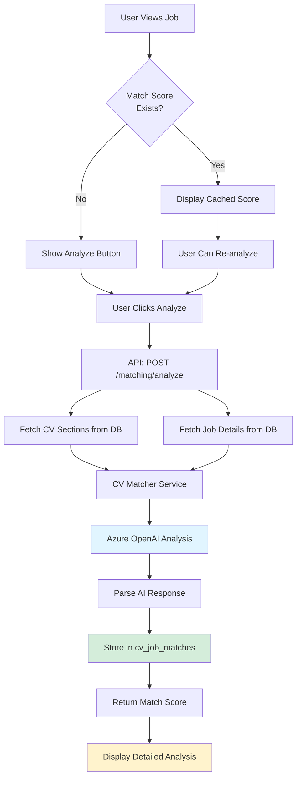
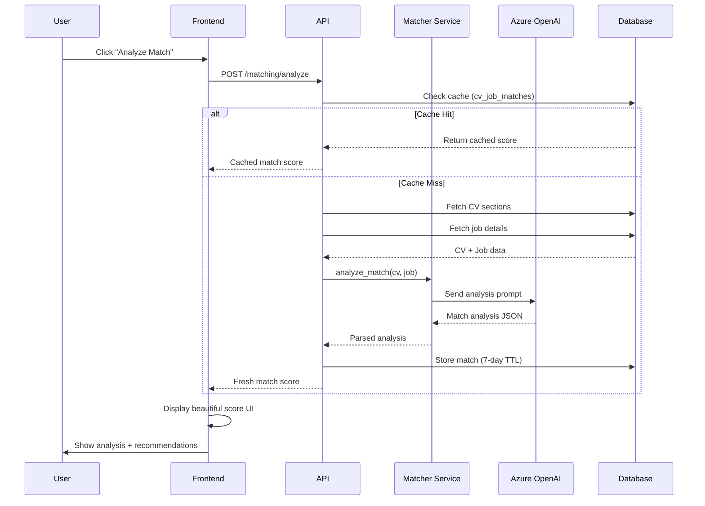
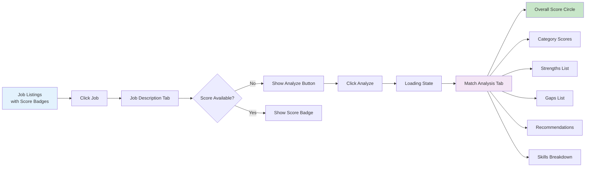

# AI CV-to-Job Match Scoring Feature Plan

## Overview
Add an AI-powered scoring system that analyzes how well a CV matches a job description. The feature provides both quick overview scores and detailed breakdowns with actionable recommendations.

## Design Decisions

### User Experience
- **Display Locations**: 
  - Job listings page: Quick match score badge (e.g., "85% Match")
  - Tailor CV page: Detailed breakdown with recommendations
- **Trigger**: Manual "Analyze Match" button with intelligent caching
- **Visual Design**: Beautiful, gradient-based score indicators with color coding

### Architecture
- **Service**: New `cv_matcher_service.py` using Azure OpenAI
- **Caching**: Database-backed with 7-day TTL
- **Performance**: Optimized prompts, single API call per analysis
- **Cost Control**: Manual trigger + caching minimizes AI costs

---

## Database Schema

### New Table: `cv_job_matches`

```sql
CREATE TABLE cv_job_matches (
  id UUID PRIMARY KEY DEFAULT gen_random_uuid(),
  cv_id UUID NOT NULL REFERENCES cvs(id) ON DELETE CASCADE,
  job_id UUID NOT NULL REFERENCES jobs(id) ON DELETE CASCADE,
  user_id UUID NOT NULL REFERENCES profiles(id) ON DELETE CASCADE,
  
  -- Overall Score
  overall_score INTEGER NOT NULL CHECK (overall_score >= 0 AND overall_score <= 100),
  
  -- Category Scores
  skills_score INTEGER CHECK (skills_score >= 0 AND skills_score <= 100),
  experience_score INTEGER CHECK (experience_score >= 0 AND experience_score <= 100),
  qualifications_score INTEGER CHECK (qualifications_score >= 0 AND qualifications_score <= 100),
  
  -- Detailed Analysis (JSON)
  analysis JSONB NOT NULL DEFAULT '{}'::jsonb,
  -- Structure: {
  --   "strengths": ["Strong Python skills", "Relevant AWS experience"],
  --   "gaps": ["Missing Kubernetes experience", "No ML background"],
  --   "recommendations": ["Emphasize Python projects", "Add cloud certifications"],
  --   "matched_skills": ["Python", "AWS", "Docker"],
  --   "missing_skills": ["Kubernetes", "ML"],
  --   "matched_qualifications": ["5+ years experience", "Bachelor's degree"],
  --   "missing_qualifications": ["MBA preferred"]
  -- }
  
  -- Metadata
  created_at TIMESTAMPTZ NOT NULL DEFAULT NOW(),
  expires_at TIMESTAMPTZ NOT NULL DEFAULT (NOW() + INTERVAL '7 days'),
  
  -- Ensure one match per CV-Job pair
  UNIQUE(cv_id, job_id)
);

-- Indexes
CREATE INDEX idx_cv_job_matches_cv ON cv_job_matches(cv_id);
CREATE INDEX idx_cv_job_matches_job ON cv_job_matches(job_id);
CREATE INDEX idx_cv_job_matches_user ON cv_job_matches(user_id);
CREATE INDEX idx_cv_job_matches_expires ON cv_job_matches(expires_at);

-- RLS Policy
ALTER TABLE cv_job_matches ENABLE ROW LEVEL SECURITY;

CREATE POLICY "Users can manage own match scores"
  ON cv_job_matches FOR ALL
  USING (auth.uid() = user_id)
  WITH CHECK (auth.uid() = user_id);

-- Cleanup expired matches (run periodically)
CREATE OR REPLACE FUNCTION cleanup_expired_matches()
RETURNS void AS $$
BEGIN
  DELETE FROM cv_job_matches WHERE expires_at < NOW();
END;
$$ LANGUAGE plpgsql;
```

---

## Backend Implementation

### 1. Service: `backend/app/services/cv_matcher.py`

```python
from openai import AsyncAzureOpenAI
from app.config import settings
import json
from typing import Dict, Any

class CVMatcherService:
    """
    AI-powered CV-to-Job matching service using Azure OpenAI.
    Analyzes compatibility and provides detailed recommendations.
    """
    
    def __init__(self):
        self.client = AsyncAzureOpenAI(
            api_key=settings.AZURE_OPENAI_KEY,
            api_version="2024-02-15-preview",
            azure_endpoint=settings.AZURE_OPENAI_ENDPOINT
        )
        self.deployment = settings.AZURE_OPENAI_DEPLOYMENT
    
    async def analyze_match(
        self, 
        cv_data: Dict[str, Any], 
        job_data: Dict[str, Any]
    ) -> Dict[str, Any]:
        """
        Analyze how well a CV matches a job description.
        
        Args:
            cv_data: Parsed CV sections (summary, skills, experience, etc.)
            job_data: Job details (title, company, description)
            
        Returns:
            Match analysis with scores and recommendations
        """
        prompt = self._build_analysis_prompt(cv_data, job_data)
        
        response = await self.client.chat.completions.create(
            model=self.deployment,
            messages=[
                {
                    "role": "system", 
                    "content": "You are an expert recruiter analyzing CV-job fit. Provide honest, actionable feedback."
                },
                {"role": "user", "content": prompt}
            ],
            temperature=0.3,
            max_tokens=1500
        )
        
        result = response.choices[0].message.content.strip()
        
        # Parse JSON response
        if result.startswith('```json'):
            result = result[7:-3]
        elif result.startswith('```'):
            result = result[3:-3]
        
        return json.loads(result.strip())
    
    def _build_analysis_prompt(
        self, 
        cv_data: Dict[str, Any], 
        job_data: Dict[str, Any]
    ) -> str:
        """Build the analysis prompt with CV and job data"""
        
        return f"""Analyze how well this CV matches the job description. Provide scores and actionable recommendations.

**Job Details:**
Title: {job_data.get('title')}
Company: {job_data.get('company')}
Description: {job_data.get('description')}

**Candidate CV:**
Summary: {cv_data.get('summary', 'Not provided')}
Skills: {', '.join(cv_data.get('skills', []))}
Experience: {json.dumps(cv_data.get('experience', []), indent=2)}
Education: {json.dumps(cv_data.get('education', []), indent=2)}
Certifications: {', '.join(cv_data.get('certifications', []))}

Return ONLY a JSON object with this structure:
{{
  "overall_score": 85,
  "skills_score": 90,
  "experience_score": 80,
  "qualifications_score": 85,
  "strengths": [
    "Strong Python and AWS experience aligns with requirements",
    "Leadership experience matches senior role expectations"
  ],
  "gaps": [
    "Missing Kubernetes experience mentioned in requirements",
    "No machine learning background for ML-related tasks"
  ],
  "recommendations": [
    "Emphasize Python projects in summary",
    "Highlight AWS certifications prominently",
    "Consider adding relevant ML coursework or projects"
  ],
  "matched_skills": ["Python", "AWS", "Docker", "CI/CD"],
  "missing_skills": ["Kubernetes", "Machine Learning", "TensorFlow"],
  "matched_qualifications": ["5+ years experience", "Bachelor's degree", "Team leadership"],
  "missing_qualifications": ["MBA (preferred)", "Public speaking experience"]
}}

Guidelines:
- Be honest but constructive
- Scores should reflect realistic match (0-100)
- Focus on actionable recommendations
- Consider both required and preferred qualifications
- Match skills even if terminology differs (e.g., "JS" vs "JavaScript")
"""

# Singleton instance
cv_matcher_service = CVMatcherService()
```

### 2. API Route: `backend/app/api/routes/matching.py`

```python
from fastapi import APIRouter, Depends, HTTPException
from app.api.deps import get_current_user
from app.services.cv_matcher import cv_matcher_service
from app.utils.supabase_client import get_supabase_client
from pydantic import BaseModel
from typing import Dict, Any, Optional
from datetime import datetime, timedelta

router = APIRouter(prefix="/matching", tags=["matching"])

class MatchRequest(BaseModel):
    cv_id: str
    job_id: str

class MatchResponse(BaseModel):
    overall_score: int
    skills_score: Optional[int]
    experience_score: Optional[int]
    qualifications_score: Optional[int]
    analysis: Dict[str, Any]
    cached: bool
    created_at: str

@router.post("/analyze", response_model=MatchResponse)
async def analyze_match(
    request: MatchRequest,
    user = Depends(get_current_user)
):
    """
    Analyze CV-to-job match. Returns cached result if available and fresh.
    """
    supabase = get_supabase_client()
    
    # Check for cached match
    cached = supabase.table('cv_job_matches') \
        .select('*') \
        .eq('cv_id', request.cv_id) \
        .eq('job_id', request.job_id) \
        .eq('user_id', user['id']) \
        .gt('expires_at', datetime.utcnow().isoformat()) \
        .execute()
    
    if cached.data:
        match = cached.data[0]
        return MatchResponse(
            overall_score=match['overall_score'],
            skills_score=match['skills_score'],
            experience_score=match['experience_score'],
            qualifications_score=match['qualifications_score'],
            analysis=match['analysis'],
            cached=True,
            created_at=match['created_at']
        )
    
    # Fetch CV data
    cv_response = supabase.table('cv_sections') \
        .select('*') \
        .eq('cv_id', request.cv_id) \
        .execute()
    
    if not cv_response.data:
        raise HTTPException(status_code=404, detail="CV not found or not parsed")
    
    cv_data = cv_response.data[0]
    
    # Fetch job data
    job_response = supabase.table('jobs') \
        .select('*') \
        .eq('id', request.job_id) \
        .eq('user_id', user['id']) \
        .execute()
    
    if not job_response.data:
        raise HTTPException(status_code=404, detail="Job not found")
    
    job_data = job_response.data[0]
    
    # Perform AI analysis
    analysis = await cv_matcher_service.analyze_match(cv_data, job_data)
    
    # Store result with 7-day expiry
    expires_at = datetime.utcnow() + timedelta(days=7)
    
    match_record = {
        'cv_id': request.cv_id,
        'job_id': request.job_id,
        'user_id': user['id'],
        'overall_score': analysis['overall_score'],
        'skills_score': analysis.get('skills_score'),
        'experience_score': analysis.get('experience_score'),
        'qualifications_score': analysis.get('qualifications_score'),
        'analysis': analysis,
        'expires_at': expires_at.isoformat()
    }
    
    # Upsert (insert or update if exists)
    supabase.table('cv_job_matches').upsert(match_record).execute()
    
    return MatchResponse(
        overall_score=analysis['overall_score'],
        skills_score=analysis.get('skills_score'),
        experience_score=analysis.get('experience_score'),
        qualifications_score=analysis.get('qualifications_score'),
        analysis=analysis,
        cached=False,
        created_at=datetime.utcnow().isoformat()
    )

@router.get("/score/{cv_id}/{job_id}", response_model=Optional[MatchResponse])
async def get_match_score(
    cv_id: str,
    job_id: str,
    user = Depends(get_current_user)
):
    """
    Get cached match score if available (for displaying badges on job listings).
    Returns null if not analyzed yet.
    """
    supabase = get_supabase_client()
    
    result = supabase.table('cv_job_matches') \
        .select('*') \
        .eq('cv_id', cv_id) \
        .eq('job_id', job_id) \
        .eq('user_id', user['id']) \
        .gt('expires_at', datetime.utcnow().isoformat()) \
        .execute()
    
    if not result.data:
        return None
    
    match = result.data[0]
    return MatchResponse(
        overall_score=match['overall_score'],
        skills_score=match['skills_score'],
        experience_score=match['experience_score'],
        qualifications_score=match['qualifications_score'],
        analysis=match['analysis'],
        cached=True,
        created_at=match['created_at']
    )
```

### 3. Register Route in `backend/app/main.py`

```python
from app.api.routes import cv, jobs, tailor, matching  # Add matching

app.include_router(matching.router, prefix="/api")
```

---

## Frontend Implementation

### 1. API Client: `src/lib/api.ts`

```typescript
// Add to existing API client

export interface MatchScore {
  overall_score: number;
  skills_score?: number;
  experience_score?: number;
  qualifications_score?: number;
  analysis: {
    strengths: string[];
    gaps: string[];
    recommendations: string[];
    matched_skills: string[];
    missing_skills: string[];
    matched_qualifications: string[];
    missing_qualifications: string[];
  };
  cached: boolean;
  created_at: string;
}

export const matchingAPI = {
  async analyze(cvId: string, jobId: string): Promise<MatchScore> {
    return fetchAPI(`/matching/analyze`, {
      method: 'POST',
      body: JSON.stringify({ cv_id: cvId, job_id: jobId }),
    });
  },

  async getScore(cvId: string, jobId: string): Promise<MatchScore | null> {
    return fetchAPI(`/matching/score/${cvId}/${jobId}`);
  },
};
```

### 2. Score Badge Component: `src/components/cv/MatchScoreBadge.tsx`

```typescript
import { Badge } from '@/components/ui/badge';
import { Target, TrendingUp, Loader2 } from 'lucide-react';
import { cn } from '@/lib/utils';

interface MatchScoreBadgeProps {
  score?: number;
  loading?: boolean;
  size?: 'sm' | 'md' | 'lg';
  showIcon?: boolean;
}

export function MatchScoreBadge({ 
  score, 
  loading = false, 
  size = 'md',
  showIcon = true 
}: MatchScoreBadgeProps) {
  if (loading) {
    return (
      <Badge variant="outline" className="gap-1">
        <Loader2 className="h-3 w-3 animate-spin" />
        Analyzing...
      </Badge>
    );
  }

  if (score === undefined) {
    return null;
  }

  const getScoreColor = (score: number) => {
    if (score >= 80) return 'from-green-500 to-emerald-600';
    if (score >= 60) return 'from-blue-500 to-cyan-600';
    if (score >= 40) return 'from-yellow-500 to-orange-500';
    return 'from-red-500 to-rose-600';
  };

  const getScoreLabel = (score: number) => {
    if (score >= 80) return 'Excellent Match';
    if (score >= 60) return 'Good Match';
    if (score >= 40) return 'Moderate Match';
    return 'Low Match';
  };

  const sizeClasses = {
    sm: 'text-xs px-2 py-0.5',
    md: 'text-sm px-3 py-1',
    lg: 'text-base px-4 py-1.5'
  };

  return (
    <div className={cn(
      "inline-flex items-center gap-1.5 rounded-full font-semibold",
      "bg-gradient-to-r text-white shadow-md",
      getScoreColor(score),
      sizeClasses[size]
    )}>
      {showIcon && <Target className="h-3.5 w-3.5" />}
      <span>{score}%</span>
      {size !== 'sm' && <span className="text-xs opacity-90">Match</span>}
    </div>
  );
}
```

### 3. Detailed Score Panel: `src/components/cv/MatchScorePanel.tsx`

```typescript
import { Card, CardContent, CardHeader, CardTitle } from '@/components/ui/card';
import { Button } from '@/components/ui/button';
import { Progress } from '@/components/ui/progress';
import { Badge } from '@/components/ui/badge';
import { 
  Target, CheckCircle2, AlertCircle, Lightbulb, 
  TrendingUp, Award, Loader2 
} from 'lucide-react';
import { MatchScore } from '@/lib/api';
import { MatchScoreBadge } from './MatchScoreBadge';

interface MatchScorePanelProps {
  score?: MatchScore | null;
  loading?: boolean;
  onAnalyze?: () => void;
}

export function MatchScorePanel({ score, loading, onAnalyze }: MatchScorePanelProps) {
  if (!score && !loading) {
    return (
      <Card className="border-dashed">
        <CardContent className="flex flex-col items-center justify-center py-12 gap-4">
          <div className="rounded-full bg-primary/10 p-4">
            <Target className="h-8 w-8 text-primary" />
          </div>
          <div className="text-center">
            <h3 className="font-semibold text-lg mb-1">Analyze Your Match</h3>
            <p className="text-sm text-muted-foreground mb-4 max-w-sm">
              Use AI to see how well your CV matches this job and get personalized recommendations
            </p>
          </div>
          <Button 
            onClick={onAnalyze} 
            className="bg-gradient-to-r from-primary to-accent hover:opacity-90"
          >
            <TrendingUp className="h-4 w-4 mr-2" />
            Analyze Match Score
          </Button>
        </CardContent>
      </Card>
    );
  }

  if (loading) {
    return (
      <Card>
        <CardContent className="flex items-center justify-center py-12">
          <div className="flex flex-col items-center gap-3">
            <Loader2 className="h-8 w-8 animate-spin text-primary" />
            <p className="text-sm text-muted-foreground">Analyzing your CV match...</p>
          </div>
        </CardContent>
      </Card>
    );
  }

  if (!score) return null;

  return (
    <div className="space-y-4">
      {/* Overall Score Card */}
      <Card className="border-2 border-primary/20 bg-gradient-to-br from-background to-primary/5">
        <CardHeader>
          <div className="flex items-center justify-between">
            <CardTitle className="text-lg">Match Score</CardTitle>
            <MatchScoreBadge score={score.overall_score} size="lg" />
          </div>
        </CardHeader>
        <CardContent className="space-y-4">
          {/* Category Scores */}
          <div className="space-y-3">
            {score.skills_score !== undefined && (
              <ScoreBar
                label="Skills Match"
                score={score.skills_score}
                icon={<Award className="h-4 w-4" />}
              />
            )}
            {score.experience_score !== undefined && (
              <ScoreBar
                label="Experience Match"
                score={score.experience_score}
                icon={<TrendingUp className="h-4 w-4" />}
              />
            )}
            {score.qualifications_score !== undefined && (
              <ScoreBar
                label="Qualifications Match"
                score={score.qualifications_score}
                icon={<CheckCircle2 className="h-4 w-4" />}
              />
            )}
          </div>
          
          {score.cached && (
            <p className="text-xs text-muted-foreground text-center pt-2 border-t">
              Analyzed {new Date(score.created_at).toLocaleDateString()}
            </p>
          )}
        </CardContent>
      </Card>

      {/* Strengths */}
      {score.analysis.strengths?.length > 0 && (
        <Card>
          <CardHeader>
            <CardTitle className="text-base flex items-center gap-2 text-green-600">
              <CheckCircle2 className="h-5 w-5" />
              Your Strengths
            </CardTitle>
          </CardHeader>
          <CardContent>
            <ul className="space-y-2">
              {score.analysis.strengths.map((strength, i) => (
                <li key={i} className="flex gap-2 text-sm">
                  <CheckCircle2 className="h-4 w-4 text-green-500 shrink-0 mt-0.5" />
                  <span>{strength}</span>
                </li>
              ))}
            </ul>
          </CardContent>
        </Card>
      )}

      {/* Gaps */}
      {score.analysis.gaps?.length > 0 && (
        <Card>
          <CardHeader>
            <CardTitle className="text-base flex items-center gap-2 text-amber-600">
              <AlertCircle className="h-5 w-5" />
              Areas to Address
            </CardTitle>
          </CardHeader>
          <CardContent>
            <ul className="space-y-2">
              {score.analysis.gaps.map((gap, i) => (
                <li key={i} className="flex gap-2 text-sm">
                  <AlertCircle className="h-4 w-4 text-amber-500 shrink-0 mt-0.5" />
                  <span>{gap}</span>
                </li>
              ))}
            </ul>
          </CardContent>
        </Card>
      )}

      {/* Recommendations */}
      {score.analysis.recommendations?.length > 0 && (
        <Card className="border-2 border-primary/30">
          <CardHeader>
            <CardTitle className="text-base flex items-center gap-2 text-primary">
              <Lightbulb className="h-5 w-5" />
              AI Recommendations
            </CardTitle>
          </CardHeader>
          <CardContent>
            <ul className="space-y-3">
              {score.analysis.recommendations.map((rec, i) => (
                <li key={i} className="flex gap-2 text-sm bg-primary/5 p-3 rounded-lg">
                  <Lightbulb className="h-4 w-4 text-primary shrink-0 mt-0.5" />
                  <span>{rec}</span>
                </li>
              ))}
            </ul>
          </CardContent>
        </Card>
      )}

      {/* Skills Breakdown */}
      {(score.analysis.matched_skills?.length > 0 || score.analysis.missing_skills?.length > 0) && (
        <Card>
          <CardHeader>
            <CardTitle className="text-base">Skills Breakdown</CardTitle>
          </CardHeader>
          <CardContent className="space-y-4">
            {score.analysis.matched_skills?.length > 0 && (
              <div>
                <p className="text-sm font-medium mb-2 text-green-600">Matched Skills</p>
                <div className="flex flex-wrap gap-2">
                  {score.analysis.matched_skills.map((skill, i) => (
                    <Badge key={i} variant="outline" className="bg-green-50 text-green-700 border-green-200">
                      <CheckCircle2 className="h-3 w-3 mr-1" />
                      {skill}
                    </Badge>
                  ))}
                </div>
              </div>
            )}
            {score.analysis.missing_skills?.length > 0 && (
              <div>
                <p className="text-sm font-medium mb-2 text-amber-600">Missing Skills</p>
                <div className="flex flex-wrap gap-2">
                  {score.analysis.missing_skills.map((skill, i) => (
                    <Badge key={i} variant="outline" className="bg-amber-50 text-amber-700 border-amber-200">
                      <AlertCircle className="h-3 w-3 mr-1" />
                      {skill}
                    </Badge>
                  ))}
                </div>
              </div>
            )}
          </CardContent>
        </Card>
      )}

      <div className="flex justify-center pt-2">
        <Button 
          variant="outline" 
          onClick={onAnalyze}
          className="gap-2"
        >
          <TrendingUp className="h-4 w-4" />
          Re-analyze Match
        </Button>
      </div>
    </div>
  );
}

// Helper component
function ScoreBar({ label, score, icon }: { label: string; score: number; icon: React.ReactNode }) {
  const getColor = (score: number) => {
    if (score >= 80) return 'bg-green-500';
    if (score >= 60) return 'bg-blue-500';
    if (score >= 40) return 'bg-yellow-500';
    return 'bg-red-500';
  };

  return (
    <div className="space-y-1.5">
      <div className="flex items-center justify-between text-sm">
        <span className="flex items-center gap-1.5 text-muted-foreground">
          {icon}
          {label}
        </span>
        <span className="font-semibold">{score}%</span>
      </div>
      <div className="relative h-2 bg-secondary rounded-full overflow-hidden">
        <div 
          className={cn("h-full transition-all duration-500 rounded-full", getColor(score))}
          style={{ width: `${score}%` }}
        />
      </div>
    </div>
  );
}
```

### 4. Integration in TailorCV Page: `src/pages/TailorCV.tsx`

```typescript
// Add to existing TailorCV.tsx

import { MatchScorePanel } from '@/components/cv/MatchScorePanel';
import { matchingAPI, type MatchScore } from '@/lib/api';

// Add to component state
const [matchScore, setMatchScore] = useState<MatchScore | null>(null);
const [analyzingMatch, setAnalyzingMatch] = useState(false);
const [primaryCvId, setPrimaryCvId] = useState<string | null>(null);

// Load match score on mount
useEffect(() => {
  if (id && primaryCvId) {
    loadMatchScore();
  }
}, [id, primaryCvId]);

async function loadMatchScore() {
  try {
    const score = await matchingAPI.getScore(primaryCvId!, id!);
    setMatchScore(score);
  } catch (error) {
    console.error('Failed to load match score:', error);
  }
}

async function handleAnalyzeMatch() {
  if (!primaryCvId || !id) return;
  
  try {
    setAnalyzingMatch(true);
    const score = await matchingAPI.analyze(primaryCvId, id);
    setMatchScore(score);
    toast.success('Match analysis complete!');
  } catch (error) {
    const message = error instanceof Error ? error.message : 'Failed to analyze match';
    toast.error(message);
  } finally {
    setAnalyzingMatch(false);
  }
}

// Add new tab for match score
<TabsList className="grid w-full max-w-2xl grid-cols-3 bg-transparent">
  <TabsTrigger value="job">...</TabsTrigger>
  <TabsTrigger value="tailor">...</TabsTrigger>
  <TabsTrigger value="score">
    <Target className="h-4 w-4 mr-2" />
    Match Analysis
  </TabsTrigger>
</TabsList>

// Add new tab content
<TabsContent value="score" className="mt-0">
  <div className="container mx-auto px-4 py-8">
    <div className="max-w-3xl mx-auto">
      <MatchScorePanel
        score={matchScore}
        loading={analyzingMatch}
        onAnalyze={handleAnalyzeMatch}
      />
    </div>
  </div>
</TabsContent>
```

### 5. Integration in Jobs List: `src/pages/Jobs.tsx`

```typescript
// Add to each job card

import { MatchScoreBadge } from '@/components/cv/MatchScoreBadge';
import { matchingAPI } from '@/lib/api';

// Load scores for all jobs
const [jobScores, setJobScores] = useState<Map<string, number>>(new Map());

useEffect(() => {
  if (jobs.length > 0 && primaryCvId) {
    loadJobScores();
  }
}, [jobs, primaryCvId]);

async function loadJobScores() {
  const scores = new Map();
  for (const job of jobs) {
    try {
      const score = await matchingAPI.getScore(primaryCvId!, job.id);
      if (score) {
        scores.set(job.id, score.overall_score);
      }
    } catch (error) {
      console.error(`Failed to load score for job ${job.id}:`, error);
    }
  }
  setJobScores(scores);
}

// In job card render
<div className="flex items-center justify-between">
  <h3 className="font-semibold">{job.title}</h3>
  <MatchScoreBadge score={jobScores.get(job.id)} size="sm" />
</div>
```

---

## System Flow Diagram



## Data Flow



## UI Mockup Flow



---

## Implementation Checklist

### Phase 1: Backend Foundation
- [ ] Create database migration for `cv_job_matches` table
- [ ] Implement `cv_matcher_service.py` with Azure OpenAI integration
- [ ] Create `matching.py` API routes
- [ ] Add routes to main.py
- [ ] Test API endpoints with curl/Postman

### Phase 2: Frontend Components
- [ ] Update API client (`src/lib/api.ts`) with matching endpoints
- [ ] Create `MatchScoreBadge.tsx` component
- [ ] Create `MatchScorePanel.tsx` component
- [ ] Add score indicators to job listings
- [ ] Integrate into TailorCV page as new tab

### Phase 3: Polish & Optimization
- [ ] Add loading states and error handling
- [ ] Implement score refresh functionality
- [ ] Add animations for score reveal
- [ ] Test caching behavior
- [ ] Add cleanup cron job for expired matches
- [ ] Performance testing with multiple jobs

### Phase 4: Enhanced Features (Future)
- [ ] Batch analysis for multiple jobs
- [ ] Email notifications for high-match jobs
- [ ] Export match report as PDF
- [ ] Historical score tracking (score over time)
- [ ] Compare multiple CVs for same job

---

## Cost Considerations

- **Azure OpenAI Usage**: ~800-1500 tokens per analysis
- **Estimated Cost**: $0.003-0.005 per analysis (GPT-4)
- **Caching Strategy**: 7-day TTL reduces repeat costs by ~90%
- **Manual Trigger**: User controls when to spend credits

## Performance Targets

- **API Response**: < 3 seconds for fresh analysis
- **Cache Lookup**: < 200ms for cached scores
- **UI Render**: < 100ms for score components
- **Batch Load**: < 5 seconds for 10 job scores

## Security Considerations

- RLS policies ensure users only see their own scores
- CV and job data validation before AI analysis
- Rate limiting on analyze endpoint (10 requests/minute)
- Sanitize AI responses before storing in database

---

## Next Steps

Once you approve this plan, I'll help you:
1. Switch to Code mode to implement the features
2. Create the database migration
3. Build the backend service and API
4. Develop the beautiful UI components
5. Test and refine the scoring algorithm

This plan provides a complete, production-ready AI matching feature that's visually stunning, cost-effective, and user-friendly.