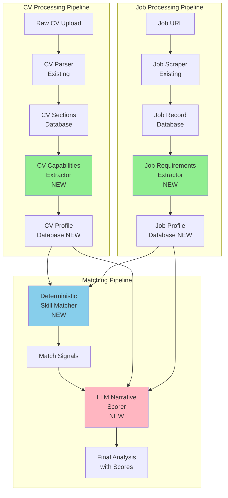

# Improved CV Matching Architecture

## Executive Summary

This document outlines the architectural improvements to the CV matching system, addressing the fundamental issue of **cognitive overload** in the current single-LLM approach. The new architecture separates concerns into specialized services, enabling deterministic matching with AI-enhanced narrative generation.

## Current Problems

### 1. Single LLM Doing Too Much
The current [`CVMatcherService`](backend/app/services/cv_matcher.py) receives unstructured data and must:
- Extract & normalize skills from free-form text
- Map synonyms (k8s→kubernetes, js→javascript)
- Infer domains & seniority levels
- Parse years of experience
- Calculate relevance scores
- Generate narrative recommendations
- Output structured JSON

**Result**: Inconsistent scores, missed matches, fragile outputs.

### 2. Unstructured Inputs
- **CV Data**: Free-form skills list, unstructured experience descriptions
- **Job Data**: Mixed responsibilities/requirements in description field
- **No Normalization**: Skills "Python", "python", "Python 3.x" treated differently

### 3. No Separation of Concerns
- Deterministic logic (exact skill matching) mixed with LLM reasoning
- Can't debug intermediate steps
- Can't cache skill matching separately from narrative generation

---

## New Architecture: Profile-Based Matching

### High-Level Flow



### Key Principles

1. **Extract Once, Use Many Times**: Profile extraction happens once per CV/job
2. **Deterministic Core**: Python handles exact matching (skills, qualifications)
3. **LLM for Nuance**: AI only generates narrative insights
4. **Debuggable Pipeline**: Can inspect each stage independently
5. **Backward Compatible**: Graceful fallback for existing data

---

## Component Designs

### 1. Job Profile Data Model

**Table**: `job_profiles`

```sql
CREATE TABLE job_profiles (
    id UUID PRIMARY KEY DEFAULT gen_random_uuid(),
    job_id UUID NOT NULL REFERENCES jobs(id) ON DELETE CASCADE,
    
    -- Normalized Skills (lowercase, deduplicated)
    required_skills TEXT[] NOT NULL DEFAULT '{}',
    preferred_skills TEXT[] NOT NULL DEFAULT '{}',
    
    -- Technologies by Category
    programming_languages TEXT[] NOT NULL DEFAULT '{}',
    frameworks TEXT[] NOT NULL DEFAULT '{}',
    databases TEXT[] NOT NULL DEFAULT '{}',
    cloud_platforms TEXT[] NOT NULL DEFAULT '{}',
    devops_tools TEXT[] NOT NULL DEFAULT '{}',
    
    -- Experience Requirements
    required_years_experience INTEGER,
    seniority_level TEXT, -- 'junior', 'mid', 'senior', 'lead', 'principal'
    experience_domains TEXT[] NOT NULL DEFAULT '{}', -- ['backend', 'frontend', 'devops', 'security']
    
    -- Qualifications
    required_qualifications TEXT[] NOT NULL DEFAULT '{}',
    preferred_qualifications TEXT[] NOT NULL DEFAULT '{}',
    required_certifications TEXT[] NOT NULL DEFAULT '{}',
    
    -- Metadata
    created_at TIMESTAMPTZ NOT NULL DEFAULT NOW(),
    updated_at TIMESTAMPTZ NOT NULL DEFAULT NOW(),
    
    UNIQUE(job_id)
);

CREATE INDEX idx_job_profiles_job_id ON job_profiles(job_id);
```

**Python Model**:

```python
from pydantic import BaseModel, Field
from typing import List, Optional

class JobProfile(BaseModel):
    """Structured, normalized job requirements profile"""
    
    # Skills
    required_skills: List[str] = Field(default_factory=list)
    preferred_skills: List[str] = Field(default_factory=list)
    
    # Tech Stack
    programming_languages: List[str] = Field(default_factory=list)
    frameworks: List[str] = Field(default_factory=list)
    databases: List[str] = Field(default_factory=list)
    cloud_platforms: List[str] = Field(default_factory=list)
    devops_tools: List[str] = Field(default_factory=list)
    
    # Experience
    required_years_experience: Optional[int] = None
    seniority_level: Optional[str] = None  # junior/mid/senior/lead/principal
    experience_domains: List[str] = Field(default_factory=list)
    
    # Qualifications
    required_qualifications: List[str] = Field(default_factory=list)
    preferred_qualifications: List[str] = Field(default_factory=list)
    required_certifications: List[str] = Field(default_factory=list)
```

---

### 2. CV Profile Data Model

**Table**: `cv_profiles`

```sql
CREATE TABLE cv_profiles (
    id UUID PRIMARY KEY DEFAULT gen_random_uuid(),
    cv_id UUID NOT NULL REFERENCES cvs(id) ON DELETE CASCADE,
    
    -- Normalized Skills (lowercase, deduplicated)
    technical_skills TEXT[] NOT NULL DEFAULT '{}',
    soft_skills TEXT[] NOT NULL DEFAULT '{}',
    
    -- Technologies by Category
    programming_languages TEXT[] NOT NULL DEFAULT '{}',
    frameworks TEXT[] NOT NULL DEFAULT '{}',
    databases TEXT[] NOT NULL DEFAULT '{}',
    cloud_platforms TEXT[] NOT NULL DEFAULT '{}',
    devops_tools TEXT[] NOT NULL DEFAULT '{}',
    
    -- Experience Profile
    total_years_experience INTEGER,
    seniority_level TEXT, -- 'junior', 'mid', 'senior', 'lead', 'principal'
    experience_domains TEXT[] NOT NULL DEFAULT '{}', -- ['backend', 'cybersecurity']
    role_history TEXT[] NOT NULL DEFAULT '{}', -- ['Software Engineer', 'Security Engineer']
    
    -- Qualifications
    degrees TEXT[] NOT NULL DEFAULT '{}',
    certifications TEXT[] NOT NULL DEFAULT '{}',
    
    -- Metadata
    created_at TIMESTAMPTZ NOT NULL DEFAULT NOW(),
    updated_at TIMESTAMPTZ NOT NULL DEFAULT NOW(),
    
    UNIQUE(cv_id)
);

CREATE INDEX idx_cv_profiles_cv_id ON cv_profiles(cv_id);
```

**Python Model**:

```python
class CVProfile(BaseModel):
    """Structured, normalized CV capabilities profile"""
    
    # Skills
    technical_skills: List[str] = Field(default_factory=list)
    soft_skills: List[str] = Field(default_factory=list)
    
    # Tech Stack
    programming_languages: List[str] = Field(default_factory=list)
    frameworks: List[str] = Field(default_factory=list)
    databases: List[str] = Field(default_factory=list)
    cloud_platforms: List[str] = Field(default_factory=list)
    devops_tools: List[str] = Field(default_factory=list)
    
    # Experience
    total_years_experience: Optional[int] = None
    seniority_level: Optional[str] = None
    experience_domains: List[str] = Field(default_factory=list)
    role_history: List[str] = Field(default_factory=list)
    
    # Qualifications
    degrees: List[str] = Field(default_factory=list)
    certifications: List[str] = Field(default_factory=list)
```

---

### 3. JobRequirementsExtractorService

**Purpose**: Transform scraped job description into normalized, structured profile.

**Input**: Scraped job data (title, company, description)
**Output**: JobProfile object

**LLM Prompt**:

```python
SYSTEM_MESSAGE = """You are a technical recruiter specialized in analyzing job postings.

Extract and normalize ALL technical requirements from the job description.

CRITICAL RULES:
1. Normalize skill names: lowercase, remove version numbers, map synonyms
   - "JavaScript" → "javascript"
   - "K8s" → "kubernetes"
   - "Python 3.x" → "python"
   - "React.js" → "react"

2. Categorize technologies correctly:
   - Languages: python, java, javascript, go, rust, etc.
   - Frameworks: react, django, flask, spring, angular, etc.
   - Databases: postgresql, mysql, mongodb, redis, etc.
   - Cloud: aws, azure, gcp, etc.
   - DevOps: docker, kubernetes, terraform, jenkins, etc.

3. Distinguish required vs preferred:
   - "Must have", "Required" → required_skills
   - "Nice to have", "Preferred", "Plus" → preferred_skills

4. Infer seniority from context:
   - Years + title + responsibilities
   - "Junior" (0-2 years), "Mid" (3-5), "Senior" (6-10), "Lead" (10+), "Principal" (15+)

5. Extract experience domains:
   - backend, frontend, fullstack, devops, data, ml, mobile, security, etc.

6. Return ONLY valid JSON matching the schema."""

USER_PROMPT = f"""
Job Title: {title}
Company: {company}
Description:
{description}

Extract structured requirements and return JSON with this exact schema:
{{
  "required_skills": [],
  "preferred_skills": [],
  "programming_languages": [],
  "frameworks": [],
  "databases": [],
  "cloud_platforms": [],
  "devops_tools": [],
  "required_years_experience": 5,
  "seniority_level": "senior",
  "experience_domains": [],
  "required_qualifications": [],
  "preferred_qualifications": [],
  "required_certifications": []
}}
"""
```

**Service Implementation**:

```python
class JobRequirementsExtractorService:
    """Extract structured requirements from job descriptions"""
    
    def __init__(self):
        self.client = AsyncAzureOpenAI(...)
        self.synonym_map = self._load_synonym_map()
    
    async def extract_profile(self, job_data: dict) -> JobProfile:
        """Extract normalized job profile using LLM"""
        
        prompt = self._build_extraction_prompt(job_data)
        
        response = await self.client.chat.completions.create(
            model=self.deployment,
            messages=[
                {"role": "system", "content": SYSTEM_MESSAGE},
                {"role": "user", "content": prompt}
            ],
            temperature=0,  # Deterministic
            max_tokens=1500
        )
        
        result = json.loads(response.choices[0].message.content)
        
        # Post-process: apply additional normalization
        profile = JobProfile(**result)
        profile = self._normalize_profile(profile)
        
        return profile
    
    def _normalize_profile(self, profile: JobProfile) -> JobProfile:
        """Apply additional normalization rules"""
        # Lowercase all skills
        profile.required_skills = [s.lower().strip() for s in profile.required_skills]
        profile.preferred_skills = [s.lower().strip() for s in profile.preferred_skills]
        
        # Apply synonym mapping
        profile.required_skills = [self.synonym_map.get(s, s) for s in profile.required_skills]
        
        # Remove duplicates while preserving order
        profile.required_skills = list(dict.fromkeys(profile.required_skills))
        
        return profile
    
    def _load_synonym_map(self) -> dict:
        """Load skill synonym mappings"""
        return {
            "k8s": "kubernetes",
            "js": "javascript",
            "ts": "typescript",
            "py": "python",
            "tf": "terraform",
            "pg": "postgresql",
            "psql": "postgresql",
            "react.js": "react",
            "vue.js": "vue",
            # ... comprehensive mapping
        }
```

---

### 4. CVCapabilitiesExtractorService

**Purpose**: Transform parsed CV sections into normalized capabilities profile.

**Input**: CV sections (summary, skills, experience, education, certifications)
**Output**: CVProfile object

**LLM Prompt**:

```python
SYSTEM_MESSAGE = """You are an expert CV analyst specialized in extracting technical capabilities.

Analyze the CV and extract normalized technical profile.

CRITICAL RULES:
1. Normalize all skill names (lowercase, map synonyms)
2. Categorize technologies by type (language, framework, database, cloud, devops)
3. Calculate total years of experience from work history
4. Infer seniority level from:
   - Years of experience
   - Job titles progression
   - Leadership indicators
5. Extract experience domains from job descriptions
6. List all degrees and certifications

Return ONLY valid JSON matching the schema."""

USER_PROMPT = f"""
Summary: {summary}

Skills: {skills}

Experience:
{format_experience(experience)}

Education:
{format_education(education)}

Certifications: {certifications}

Extract normalized capabilities and return JSON with this exact schema:
{{
  "technical_skills": [],
  "soft_skills": [],
  "programming_languages": [],
  "frameworks": [],
  "databases": [],
  "cloud_platforms": [],
  "devops_tools": [],
  "total_years_experience": 10,
  "seniority_level": "senior",
  "experience_domains": [],
  "role_history": [],
  "degrees": [],
  "certifications": []
}}
"""
```

**Service Implementation**: Similar to JobRequirementsExtractorService

---

### 5. DeterministicSkillMatcher

**Purpose**: Pure Python logic for exact skill/qualification matching.

**Input**: JobProfile + CVProfile
**Output**: MatchSignals (raw matching data)

```python
from dataclasses import dataclass
from typing import List, Set

@dataclass
class MatchSignals:
    """Raw signals from deterministic matching"""
    
    # Skills
    matched_required_skills: List[str]
    missing_required_skills: List[str]
    matched_preferred_skills: List[str]
    missing_preferred_skills: List[str]
    
    # Tech Stack
    matched_languages: List[str]
    matched_frameworks: List[str]
    matched_databases: List[str]
    matched_cloud: List[str]
    matched_devops: List[str]
    
    # Experience
    years_experience_gap: int  # positive = exceeds, negative = lacks
    seniority_match: bool
    domain_overlap: List[str]
    domain_gaps: List[str]
    
    # Qualifications
    matched_qualifications: List[str]
    missing_qualifications: List[str]
    matched_certifications: List[str]
    missing_certifications: List[str]
    
    # Scores (deterministic)
    required_skills_score: int  # 0-100
    preferred_skills_score: int  # 0-100
    tech_stack_score: int  # 0-100
    experience_score: int  # 0-100
    qualifications_score: int  # 0-100


class DeterministicSkillMatcher:
    """Pure Python skill and qualification matching"""
    
    def match(self, job_profile: JobProfile, cv_profile: CVProfile) -> MatchSignals:
        """Perform deterministic matching"""
        
        # 1. Required Skills Matching
        job_required = set(job_profile.required_skills)
        cv_skills = set(cv_profile.technical_skills)
        
        matched_required = list(job_required & cv_skills)
        missing_required = list(job_required - cv_skills)
        
        required_score = (len(matched_required) / len(job_required) * 100) if job_required else 100
        
        # 2. Preferred Skills Matching
        job_preferred = set(job_profile.preferred_skills)
        matched_preferred = list(job_preferred & cv_skills)
        missing_preferred = list(job_preferred - cv_skills)
        
        preferred_score = (len(matched_preferred) / len(job_preferred) * 100) if job_preferred else 100
        
        # 3. Tech Stack Matching
        tech_score = self._calculate_tech_stack_score(job_profile, cv_profile)
        
        # 4. Experience Matching
        years_gap = (cv_profile.total_years_experience or 0) - (job_profile.required_years_experience or 0)
        seniority_match = cv_profile.seniority_level == job_profile.seniority_level
        
        job_domains = set(job_profile.experience_domains)
        cv_domains = set(cv_profile.experience_domains)
        domain_overlap = list(job_domains & cv_domains)
        domain_gaps = list(job_domains - cv_domains)
        
        exp_score = self._calculate_experience_score(years_gap, seniority_match, domain_overlap, job_domains)
        
        # 5. Qualifications Matching
        qual_score, matched_quals, missing_quals = self._match_qualifications(job_profile, cv_profile)
        
        return MatchSignals(
            matched_required_skills=matched_required,
            missing_required_skills=missing_required,
            matched_preferred_skills=matched_preferred,
            missing_preferred_skills=missing_preferred,
            matched_languages=self._match_list(job_profile.programming_languages, cv_profile.programming_languages),
            matched_frameworks=self._match_list(job_profile.frameworks, cv_profile.frameworks),
            matched_databases=self._match_list(job_profile.databases, cv_profile.databases),
            matched_cloud=self._match_list(job_profile.cloud_platforms, cv_profile.cloud_platforms),
            matched_devops=self._match_list(job_profile.devops_tools, cv_profile.devops_tools),
            years_experience_gap=years_gap,
            seniority_match=seniority_match,
            domain_overlap=domain_overlap,
            domain_gaps=domain_gaps,
            matched_qualifications=matched_quals,
            missing_qualifications=missing_quals,
            matched_certifications=self._match_list(job_profile.required_certifications, cv_profile.certifications),
            missing_certifications=list(set(job_profile.required_certifications) - set(cv_profile.certifications)),
            required_skills_score=int(required_score),
            preferred_skills_score=int(preferred_score),
            tech_stack_score=int(tech_score),
            experience_score=int(exp_score),
            qualifications_score=int(qual_score)
        )
    
    def _calculate_experience_score(self, years_gap: int, seniority_match: bool, 
                                    domain_overlap: List[str], required_domains: Set[str]) -> float:
        """Calculate experience score based on multiple factors"""
        score = 0
        
        # Years of experience (40 points)
        if years_gap >= 0:
            score += 40  # Meets or exceeds
        elif years_gap >= -2:
            score += 30  # Within 2 years
        elif years_gap >= -4:
            score += 20  # Within 4 years
        else:
            score += 10  # More than 4 years short
        
        # Seniority match (30 points)
        score += 30 if seniority_match else 15
        
        # Domain overlap (30 points)
        if required_domains:
            domain_score = (len(domain_overlap) / len(required_domains)) * 30
            score += domain_score
        else:
            score += 30  # No specific domain required
        
        return min(100, score)
    
    # ... other helper methods
```

---

### 6. Improved CVMatcherService (LLM Narrative Scorer)

**Purpose**: Generate human-readable narrative from deterministic signals.

**Input**: MatchSignals + JobProfile + CVProfile
**Output**: Final analysis with narrative

```python
class CVMatcherService:
    """LLM-based narrative scorer using pre-computed signals"""
    
    async def analyze_match(
        self,
        job_profile: JobProfile,
        cv_profile: CVProfile,
        signals: MatchSignals
    ) -> Dict[str, Any]:
        """Generate narrative analysis from match signals"""
        
        system_message = """You are an expert technical recruiter.

You will receive:
1. Pre-computed match signals (exact skill matches, scores)
2. Job requirements profile
3. Candidate capabilities profile

Your task: Generate concise, actionable narrative insights.

Focus on:
- Key strengths (what makes them a good fit)
- Critical gaps (what's missing)
- Specific recommendations (how to improve their application)

Be concise, specific, and actionable. Reference actual technologies/skills.
Output only valid JSON."""

        prompt = f"""
## Match Signals (Pre-Computed)
Required Skills Score: {signals.required_skills_score}/100
Preferred Skills Score: {signals.preferred_skills_score}/100
Experience Score: {signals.experience_score}/100
Qualifications Score: {signals.qualifications_score}/100

Matched Required Skills: {signals.matched_required_skills}
Missing Required Skills: {signals.missing_required_skills}
Matched Preferred Skills: {signals.matched_preferred_skills}

Years Experience Gap: {signals.years_experience_gap}
Seniority Match: {signals.seniority_match}
Domain Overlap: {signals.domain_overlap}
Domain Gaps: {signals.domain_gaps}

## Job Requirements Summary
Seniority: {job_profile.seniority_level}
Required Skills: {job_profile.required_skills[:10]}
Domains: {job_profile.experience_domains}

## Candidate Profile Summary
Seniority: {cv_profile.seniority_level}
Years Experience: {cv_profile.total_years_experience}
Skills: {cv_profile.technical_skills[:10]}
Domains: {cv_profile.experience_domains}

Generate narrative analysis as JSON:
{{
  "strengths": ["strength 1", "strength 2", ...],  // 3-5 items max
  "gaps": ["gap 1", "gap 2", ...],  // 3-5 items max
  "recommendations": ["rec 1", "rec 2", ...]  // 3-5 items max
}}
"""

        response = await self.client.chat.completions.create(
            model=self.deployment,
            messages=[
                {"role": "system", "content": system_message},
                {"role": "user", "content": prompt}
            ],
            temperature=0.3,  # Slight creativity for narrative
            max_tokens=800
        )
        
        narrative = json.loads(response.choices[0].message.content)
        
        # Calculate overall score from component scores
        overall_score = int(
            signals.required_skills_score * 0.40 +
            signals.experience_score * 0.40 +
            signals.qualifications_score * 0.20
        )
        
        return {
            "overall_score": overall_score,
            "skills_score": signals.required_skills_score,
            "experience_score": signals.experience_score,
            "qualifications_score": signals.qualifications_score,
            "strengths": narrative["strengths"],
            "gaps": narrative["gaps"],
            "recommendations": narrative["recommendations"],
            "matched_skills": signals.matched_required_skills,
            "missing_skills": signals.missing_required_skills,
            "matched_qualifications": signals.matched_qualifications,
            "missing_qualifications": signals.missing_qualifications
        }
```

---

## Integration Strategy

### Phase 1: Add Profile Extraction (Week 1-2)

1. **Database Migration**
   - Create `job_profiles` table
   - Create `cv_profiles` table
   - Add indexes

2. **Implement Services**
   - `JobRequirementsExtractorService`
   - `CVCapabilitiesExtractorService`
   - Synonym mapping utilities

3. **Integrate with Existing Pipeline**
   - Job scraping: After saving job, extract profile
   - CV parsing: After saving sections, extract profile
   - Both optional: Graceful fallback if extraction fails

4. **Test Profile Extraction**
   - Verify normalization works
   - Check synonym mapping
   - Validate categorization

### Phase 2: Add Deterministic Matching (Week 3)

1. **Implement DeterministicSkillMatcher**
   - Pure Python matching logic
   - Unit tests for all scenarios

2. **Update Matching Endpoint**
   - Check for profiles first
   - Use deterministic matcher if available
   - Fallback to old matcher if profiles missing

3. **Test Both Paths**
   - New: Profile-based matching
   - Old: Direct section matching
   - Compare accuracy

### Phase 3: Enhance with LLM Narrative (Week 4)

1. **Update CVMatcherService**
   - Accept MatchSignals as input
   - Generate narrative only
   - Simpler, shorter prompts

2. **Full Integration**
   - Profile extraction → Deterministic matching → LLM narrative
   - Cache at each stage

3. **Migration Script**
   - Backfill profiles for existing CVs/jobs
   - Re-analyze existing matches

---

## Migration Strategy for Existing Data

### Script: `migrate_to_profiles.py`

```python
"""
Migrate existing CVs and Jobs to new profile-based system
"""

async def migrate_existing_data():
    """Backfill profiles for existing data"""
    
    # 1. Migrate existing jobs
    jobs = supabase.table('jobs').select('*').execute()
    for job in jobs.data:
        try:
            profile = await job_extractor.extract_profile(job)
            supabase.table('job_profiles').upsert({
                'job_id': job['id'],
                **profile.dict()
            }).execute()
            print(f"✓ Job {job['id']}: Profile created")
        except Exception as e:
            print(f"✗ Job {job['id']}: {e}")
    
    # 2. Migrate existing CVs
    cvs = supabase.table('cvs').select('*').eq('status', 'parsed').execute()
    for cv in cvs.data:
        try:
            sections = supabase.table('cv_sections').select('*').eq('cv_id', cv['id']).single().execute()
            profile = await cv_extractor.extract_profile(sections.data)
            supabase.table('cv_profiles').upsert({
                'cv_id': cv['id'],
                **profile.dict()
            }).execute()
            print(f"✓ CV {cv['id']}: Profile created")
        except Exception as e:
            print(f"✗ CV {cv['id']}: {e}")
```

---

## Benefits Summary

### 1. **Accuracy**
- Deterministic skill matching eliminates LLM hallucinations
- Consistent synonym mapping
- Reliable scoring

### 2. **Performance**
- Profile extraction once, reuse many times
- Faster matching (Python vs LLM)
- Better caching opportunities

### 3. **Debuggability**
- Inspect profiles independently
- See exact match signals
- Understand score calculations

### 4. **Maintainability**
- Simpler, focused prompts
- Easier to update skill mappings
- Clear separation of concerns

### 5. **Tailoring Ready**
- Structured profiles enable precise CV modifications
- Know exactly what skills to add/emphasize
- Clear gap identification

---

## Implementation Checklist

- [ ] Create database migrations for `job_profiles` and `cv_profiles`
- [ ] Implement `JobRequirementsExtractorService` with LLM prompt
- [ ] Implement `CVCapabilitiesExtractorService` with LLM prompt
- [ ] Build synonym mapping system
- [ ] Implement `DeterministicSkillMatcher` (pure Python)
- [ ] Update `CVMatcherService` to use signals + generate narrative
- [ ] Integrate extractors into job scraping pipeline
- [ ] Integrate extractors into CV parsing pipeline
- [ ] Update matching endpoint to use new pipeline
- [ ] Add fallback logic for missing profiles
- [ ] Create migration script for existing data
- [ ] Add unit tests for all new components
- [ ] Update API documentation
- [ ] Monitor and validate accuracy improvements

---

## Next Steps

Ready to switch to **Code mode** to implement this architecture?

Suggested implementation order:
1. Database migrations
2. Data models (Pydantic)
3. JobRequirementsExtractorService
4. Integration with job scraping
5. Test with real jobs
6. CVCapabilitiesExtractorService (once job side working)
7. DeterministicSkillMatcher
8. Updated CVMatcherService
9. Full integration + migration
