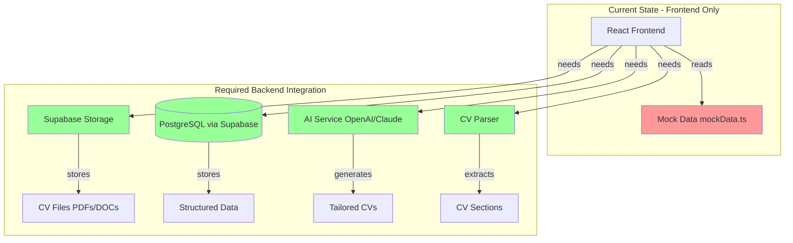

# TailorJob.ai - Architecture Gaps Analysis

## Executive Summary

Your application has a **solid frontend foundation** with authentication working via Supabase, but **all core business logic is currently using mock data**. The app demonstrates the user experience but lacks backend integration for CV processing, job management, and AI-powered tailoring.

---

## ✅ What's Working (Complete)

### 1. **Authentication & User Management**
- ✅ Google OAuth via Supabase Auth
- ✅ User session management
- ✅ Protected routes
- ✅ User profiles table with automatic creation
- ✅ Sign up/Login/Logout flows

**Status**: **Production-ready** ✓

---

## 🔴 Critical Gaps (Mock/Placeholder Implementations)

### 1. **CV Upload & Storage** - [`UploadCV.tsx`](src/pages/UploadCV.tsx)

**Current State**: Mock upload with 2-second delay
```typescript
// Line 19-29: Mock implementation
const handleUpload = async () => {
  await new Promise(resolve => setTimeout(resolve, 2000));
  toast.success('CV uploaded successfully!');
  navigate('/cv-preview');
};
```

**Missing**:
- ❌ No actual file upload to Supabase Storage
- ❌ No file validation (size, format)
- ❌ No CV parsing (PDF/DOC → structured data)
- ❌ No database storage of CV metadata
- ❌ No error handling for upload failures

**Impact**: **HIGH** - Core feature completely non-functional

---

### 2. **CV Parsing** - [`CVPreview.tsx`](src/pages/CVPreview.tsx)

**Current State**: Displays hardcoded [`mockParsedCV`](src/lib/mockData.ts:46-94)
```typescript
// Line 7: All data is mock
import { mockParsedCV } from '@/lib/mockData';
```

**Missing**:
- ❌ No CV text extraction service
- ❌ No AI/ML parsing to extract:
  - Summary
  - Skills
  - Experience (title, company, dates, descriptions)
  - Education
- ❌ No ability to edit parsed data
- ❌ No user-specific CV storage

**Impact**: **CRITICAL** - Users cannot actually parse their CVs

---

### 3. **Job Management** - [`Dashboard.tsx`](src/pages/Dashboard.tsx) & [`AddJob.tsx`](src/pages/AddJob.tsx)

**Current State**: Uses hardcoded [`mockJobs`](src/lib/mockData.ts:96-136) array
```typescript
// Dashboard.tsx Line 7
import { mockJobs } from '@/lib/mockData';

// AddJob.tsx Line 28-32: Mock save
await new Promise(resolve => setTimeout(resolve, 500));
toast.success('Job saved successfully!');
navigate('/jobs/1/tailor'); // Hardcoded job ID
```

**Missing**:
- ❌ No `jobs` database table
- ❌ No CRUD operations (Create, Read, Update, Delete)
- ❌ No user-job relationship (multi-user support)
- ❌ No job search/filter functionality
- ❌ Jobs not persisted between sessions

**Impact**: **HIGH** - Users lose all job data on page refresh

---

### 4. **AI CV Tailoring** - [`TailorCV.tsx`](src/pages/TailorCV.tsx)

**Current State**: Mock AI responses with hardcoded delays
```typescript
// Line 29-38: Fake AI chat response
setTimeout(() => {
  const aiMessage: ChatMessage = {
    content: "I've analyzed your request. Here are some suggestions..."
  };
  setMessages(prev => [...prev, aiMessage]);
}, 1000);
```

**Missing**:
- ❌ No AI/LLM integration (OpenAI, Anthropic, etc.)
- ❌ No actual CV content modification
- ❌ No job description analysis
- ❌ No keyword matching/optimization
- ❌ No ATS (Applicant Tracking System) optimization
- ❌ Chat messages not persisted

**Impact**: **CRITICAL** - Main value proposition not implemented

---

### 5. **CV Editor & Revisions** - [`TailorCV.tsx`](src/pages/TailorCV.tsx)

**Current State**: Local state only, using [`mockTailoredCV`](src/lib/mockData.ts:138-177) and [`mockRevisions`](src/lib/mockData.ts:188-207)
```typescript
// Line 14-16: All in-memory state
const [cvContent, setCvContent] = useState(mockTailoredCV);
const [revisions, setRevisions] = useState<Revision[]>(mockRevisions);

// Line 41-49: Mock save
const handleSaveRevision = () => {
  setRevisions([newRevision, ...revisions]);
  toast.success('Revision saved!');
};
```

**Missing**:
- ❌ No database storage for tailored CVs
- ❌ No revision history persistence
- ❌ No ability to restore previous versions
- ❌ No version control/diff tracking
- ❌ Changes lost on page refresh

**Impact**: **HIGH** - Users lose all work when leaving page

---

### 6. **PDF Export** - [`TailorCV.tsx`](src/pages/TailorCV.tsx)

**Current State**: Mock toast notification
```typescript
// Line 52-54: No actual export
const handleExportPDF = () => {
  toast.success('PDF export started! (This is a mock action)');
};
```

**Missing**:
- ❌ No PDF generation library integration
- ❌ No formatting/styling for PDF output
- ❌ No download mechanism
- ❌ No custom templates

**Impact**: **HIGH** - Users cannot get final deliverable

---

### 7. **Dashboard CV Display** - [`Dashboard.tsx`](src/pages/Dashboard.tsx)

**Current State**: Hardcoded CV info
```typescript
// Line 50-55: Static data
<CardDescription>Last uploaded: January 15, 2024</CardDescription>
<p className="font-medium text-foreground">john_doe_cv.pdf</p>
<p className="text-sm text-muted-foreground">245 KB</p>
```

**Missing**:
- ❌ No fetching of user's actual CV
- ❌ No display of real upload date
- ❌ No actual file metadata
- ❌ No handling of "no CV uploaded" state

**Impact**: **MEDIUM** - Misleading user information

---

## 📊 Missing Database Tables

### Current Schema
```sql
-- Only 1 table exists:
profiles (id, email, full_name, avatar_url, created_at, updated_at)
```

### Required Schema

```sql
-- CV Documents
cvs (
  id UUID PRIMARY KEY,
  user_id UUID REFERENCES profiles(id),
  original_filename TEXT,
  file_path TEXT, -- Supabase Storage path
  file_size INTEGER,
  uploaded_at TIMESTAMP,
  parsed_at TIMESTAMP,
  status TEXT -- 'uploaded', 'parsing', 'parsed', 'failed'
)

-- Parsed CV Data
cv_sections (
  id UUID PRIMARY KEY,
  cv_id UUID REFERENCES cvs(id),
  summary TEXT,
  skills JSONB, -- Array of strings
  experience JSONB, -- Array of experience objects
  education JSONB, -- Array of education objects
  updated_at TIMESTAMP
)

-- Job Descriptions
jobs (
  id UUID PRIMARY KEY,
  user_id UUID REFERENCES profiles(id),
  title TEXT NOT NULL,
  company TEXT NOT NULL,
  description TEXT NOT NULL,
  created_at TIMESTAMP,
  updated_at TIMESTAMP
)

-- Tailored CVs
tailored_cvs (
  id UUID PRIMARY KEY,
  user_id UUID REFERENCES profiles(id),
  cv_id UUID REFERENCES cvs(id),
  job_id UUID REFERENCES jobs(id),
  content TEXT, -- Markdown or HTML
  created_at TIMESTAMP,
  updated_at TIMESTAMP
)

-- CV Revisions (Version History)
cv_revisions (
  id UUID PRIMARY KEY,
  tailored_cv_id UUID REFERENCES tailored_cvs(id),
  content TEXT,
  revision_type TEXT, -- 'ai', 'user', 'manual_save'
  description TEXT,
  created_at TIMESTAMP
)

-- Chat Messages (AI Conversations)
chat_messages (
  id UUID PRIMARY KEY,
  tailored_cv_id UUID REFERENCES tailored_cvs(id),
  role TEXT, -- 'user', 'assistant'
  content TEXT,
  created_at TIMESTAMP
)
```

---

## 🔧 Missing Integrations

### 1. **File Storage** (Supabase Storage)
- Setup storage bucket for CV uploads
- Implement upload/download policies
- Handle file validation

### 2. **CV Parsing Service**
- **Options**:
  - PDF.js for client-side parsing
  - Server-side parsing with pdf-parse (Node.js)
  - Third-party API (e.g., Affinda, HireAbility)
  - Custom AI model (GPT-4 Vision for PDF parsing)

### 3. **AI/LLM Integration**
- **For CV Tailoring**:
  - OpenAI GPT-4 / GPT-4o
  - Anthropic Claude
  - Azure OpenAI
- **For Features**:
  - CV-to-job matching
  - Keyword optimization
  - ATS optimization
  - Rewriting suggestions
  - Chat-based refinements

### 4. **PDF Generation**
- **Options**:
  - jsPDF + html2canvas (client-side)
  - Puppeteer (server-side)
  - react-pdf
  - PDFKit

---

## 📋 Implementation Priority Matrix

| Feature | Impact | Effort | Priority |
|---------|--------|--------|----------|
| Database Schema | Critical | Medium | **P0** |
| CV Upload to Storage | Critical | Low | **P0** |
| Job CRUD Operations | High | Low | **P0** |
| CV Parsing (Basic) | Critical | High | **P1** |
| AI CV Tailoring | Critical | High | **P1** |
| Revision History | High | Medium | **P2** |
| PDF Export | High | Medium | **P2** |
| Chat Persistence | Medium | Low | **P3** |

---

## 🎯 Recommended Implementation Phases

### **Phase 1: Data Persistence** (Week 1)
1. Create database migrations for all tables
2. Implement Supabase Storage for CV uploads
3. Build CRUD operations for jobs
4. Store user CVs with metadata

### **Phase 2: CV Processing** (Week 2-3)
1. Integrate CV parsing library/API
2. Extract and store structured CV data
3. Display real parsed data in CVPreview
4. Allow editing of parsed sections

### **Phase 3: AI Integration** (Week 3-4)
1. Set up OpenAI/Anthropic API
2. Implement CV-to-job matching logic
3. Build AI tailoring prompts
4. Create real-time chat interface
5. Store tailored CV versions

### **Phase 4: Export & Polish** (Week 4-5)
1. Implement PDF generation
2. Add revision history tracking
3. Build CV templates
4. Add export options (PDF, DOCX)

---

## 💡 Quick Wins (Can Implement Immediately)

1. **Form Validation**: Add proper validation to AddJob and UploadCV forms
2. **Error States**: Add proper error handling UI components
3. **Loading States**: Replace mock delays with proper loading indicators
4. **Empty States**: Add "No CV uploaded" and "No jobs" states
5. **File Validation**: Client-side file size/type checking before upload

---

## 🔐 Security Considerations

### Missing Row-Level Security (RLS) Policies
All new tables need RLS policies:
```sql
-- Example for jobs table
CREATE POLICY "Users can view their own jobs"
ON jobs FOR SELECT
USING (auth.uid() = user_id);

CREATE POLICY "Users can insert their own jobs"
ON jobs FOR INSERT
WITH CHECK (auth.uid() = user_id);

CREATE POLICY "Users can update their own jobs"
ON jobs FOR UPDATE
USING (auth.uid() = user_id);

CREATE POLICY "Users can delete their own jobs"
ON jobs FOR DELETE
USING (auth.uid() = user_id);
```

---

## 📐 Architecture Diagram



---

## 🎬 Next Steps

1. **Review this analysis** with your team
2. **Prioritize features** based on business needs
3. **Create database migrations** for new tables
4. **Set up Supabase Storage** bucket
5. **Choose AI provider** (OpenAI vs. Claude vs. other)
6. **Select CV parsing strategy** (client vs. server vs. API)
7. **Implement Phase 1** (data persistence layer)

---

## 📞 Questions to Answer

1. **AI Provider Budget**: What's the monthly budget for AI API calls?
2. **CV Parsing**: Client-side or server-side parsing? Privacy concerns?
3. **Storage Limits**: How many CVs per user? File size limits?
4. **Export Formats**: PDF only or also DOCX/HTML?
5. **Templates**: Should users have multiple CV templates to choose from?
6. **ATS Optimization**: How important is ATS compatibility vs. design?

---

**Generated**: 2025-01-22  
**Status**: Ready for implementation planning