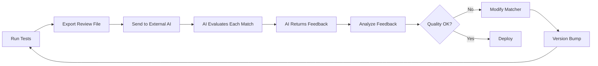

# CV Matcher Testing & Improvement Architecture

## Overview

This document outlines a comprehensive testing and improvement framework for the CV matcher mechanism. The system enables batch testing of CVs against job descriptions and exports results in a format suitable for external AI evaluation (e.g., via Roo or other AI systems).

## Current Implementation Analysis

### Existing Components

1. **CV Matcher Service** ([`backend/app/services/cv_matcher.py`](backend/app/services/cv_matcher.py:1))
   - Uses Azure OpenAI (GPT-4) for AI-powered matching
   - Analyzes: skills, experience, qualifications
   - Outputs: scores (0-100), strengths, gaps, recommendations
   - Already logs matches to `logs/match_analysis/YYYY-MM-DD.jsonl`
   - Temperature=0 for deterministic results

2. **Matching API** ([`backend/app/api/routes/matching.py`](backend/app/api/routes/matching.py:1))
   - Caches results (7-day expiry) in `cv_job_matches` table
   - Handles CV/job data fetching from Supabase
   - Returns detailed match breakdowns

3. **CV Parser Service** ([`backend/app/services/cv_parser.py`](backend/app/services/cv_parser.py:1))
   - Extracts text from PDFs
   - Uses Azure OpenAI to parse structured CV data

### Current Limitations

- No systematic way to test multiple CVs against multiple jobs
- No consolidated export format for manual/AI review
- No regression testing framework
- Manual prompt tuning without quantitative feedback
- No comparison between different matcher versions

---

## Proposed Architecture

### 1. Test Data Structure

```
backend/test_data/
├── cvs/                          # CV files (PDF or JSON)
│   ├── frontend-senior.pdf
│   ├── backend-mid.pdf
│   ├── fullstack-junior.json     # Pre-parsed JSON for faster testing
│   └── ...
├── jobs.jsonl                    # Job descriptions (one per line)
└── test_suites/                  # Curated test combinations (optional)
    ├── domain_mismatch.json      # Backend CV vs Frontend Job
    ├── skill_matching.json       # Test skill extraction accuracy
    └── qualification_logic.json  # Test education/experience evaluation
```

#### File Formats

**jobs.jsonl** (JSON Lines - one job per line):
```json
{"id": "job-001", "title": "Senior Frontend Engineer", "company": "TechCorp", "url": "https://...", "description": "..."}
{"id": "job-002", "title": "Backend Python Developer", "company": "StartupXYZ", "url": "https://...", "description": "..."}
```

**test_suites/domain_mismatch.json** (optional - for curated test cases):
```json
{
  "name": "Domain Mismatch Tests",
  "description": "Verify low scores when CV domain doesn't match job domain",
  "test_cases": [
    {
      "cv": "backend-senior.pdf",
      "job_id": "job-001",
      "notes": "Backend expert applying to frontend role - expect low score"
    }
  ]
}
```

---

### 2. Test Execution Framework

**Component: Batch Matcher Runner** (`backend/test_matcher.py`)

```python
# High-level design
class MatcherTestRunner:
    """
    Runs CV matcher against test data and exports results for review
    """
    
    async def run_all_combinations(
        cv_folder: str, 
        jobs_file: str,
        output_dir: str
    ) -> str:
        """
        Test every CV against every job (N×M matrix)
        
        Returns: Path to consolidated review file
        """
        # 1. Load all CVs (parse PDFs if needed)
        # 2. Load all jobs from JSONL
        # 3. For each CV × Job combination:
        #    - Run matcher
        #    - Store result
        # 4. Export consolidated review file
        # 5. Generate summary stats
    
    async def run_test_suite(
        suite_file: str,
        output_dir: str
    ) -> str:
        """
        Run specific test cases from a suite
        
        Returns: Path to review file
        """
        # Similar but only runs specified combinations
    
    async def run_from_urls(
        cv_folder: str, 
        job_urls: List[str],
        output_dir: str
    ) -> str:
        """
        Scrape jobs from URLs and test against CVs
        
        Returns: Path to review file
        """
        # Uses job_scraper_service to fetch jobs
```

**Features:**
- Parallel execution for speed
- Progress tracking with ETA
- Resume capability (skip already tested combinations)
- Version tagging (track which matcher version produced results)
- Deterministic ordering for reproducibility

---

### 3. Output Format for External Review

**Key Principle**: Export a **single comprehensive file** containing:
- Complete CV data
- Complete job description
- Matcher output (scores, skills, gaps, recommendations)
- All metadata needed for evaluation

**Format: JSON Lines** (one test case per line for easy streaming)

**File: `test_results/review_YYYYMMDD_HHMMSS.jsonl`**

Each line is a complete test case:

```json
{
  "test_id": "cv-001_job-003",
  "timestamp": "2025-11-25T16:30:00Z",
  "matcher_version": "1.2.0",
  
  "cv": {
    "identifier": "backend-senior.pdf",
    "original_file": "test_data/cvs/backend-senior.pdf",
    "parsed_data": {
      "summary": "Senior backend engineer with 8 years...",
      "skills": ["Python", "Django", "PostgreSQL", "Redis", "Docker", "AWS"],
      "experience": [
        {
          "title": "Senior Backend Engineer",
          "company": "TechCorp",
          "period": "2020-Present",
          "description": ["Built microservices...", "Led team of 4..."]
        }
      ],
      "education": [
        {
          "degree": "B.Sc. Computer Science",
          "institution": "MIT",
          "year": "2015"
        }
      ],
      "certifications": ["AWS Solutions Architect"]
    }
  },
  
  "job": {
    "id": "job-003",
    "title": "Senior Frontend Developer",
    "company": "StartupXYZ",
    "url": "https://example.com/jobs/123",
    "description": {
      "text": "We're looking for a Senior Frontend Developer...",
      "responsibilities": [
        "Build responsive React applications",
        "Lead frontend architecture decisions",
        "Mentor junior developers"
      ],
      "requirements": [
        "5+ years React experience",
        "Expert in TypeScript, HTML, CSS",
        "Experience with state management (Redux/Zustand)",
        "Strong understanding of web performance"
      ],
      "qualifications": [
        "Bachelor's degree in CS or equivalent experience",
        "Portfolio of production applications"
      ]
    }
  },
  
  "match_result": {
    "overall_score": 42,
    "skills_score": 25,
    "experience_score": 50,
    "qualifications_score": 100,
    "strengths": [
      "Strong software engineering fundamentals",
      "Solid educational background",
      "Proven leadership experience"
    ],
    "gaps": [
      "No frontend development experience mentioned",
      "Missing React, TypeScript, HTML, CSS skills",
      "Backend-focused career trajectory"
    ],
    "recommendations": [
      "Consider building frontend projects to demonstrate capability",
      "Highlight any JavaScript or UI work from past roles",
      "Emphasize transferable skills like architecture and leadership"
    ],
    "matched_skills": [],
    "missing_skills": ["React", "TypeScript", "HTML", "CSS", "Redux", "Zustand"],
    "matched_qualifications": ["Bachelor's degree in CS"],
    "missing_qualifications": ["Portfolio of production frontend applications"]
  },
  
  "metadata": {
    "execution_time_ms": 1234,
    "model": "gpt-4",
    "temperature": 0
  }
}
```

**Why JSON Lines?**
- Easy to stream and process line-by-line
- Can append results incrementally
- Each line is self-contained
- Simple to split for parallel review
- Works well with standard tools (jq, grep, etc.)

---

### 4. Alternative Output Formats

**Option A: Single JSON Array** (if file size isn't huge)
```json
{
  "run_metadata": {
    "run_id": "run-20251125-163000",
    "matcher_version": "1.2.0",
    "timestamp": "2025-11-25T16:30:00Z",
    "total_tests": 50
  },
  "test_cases": [
    { /* test case 1 */ },
    { /* test case 2 */ },
    ...
  ]
}
```

**Option B: Directory Structure** (for very large test runs)
```
test_results/run-20251125-163000/
├── manifest.json                    # Run metadata
├── cases/
│   ├── cv-001_job-003.json         # One file per test
│   ├── cv-001_job-004.json
│   └── ...
└── summary.json                     # Aggregate stats
```

**Option C: Markdown Report** (human-readable)
```markdown
# CV Matcher Test Results
Run ID: run-20251125-163000
Version: 1.2.0
Date: 2025-11-25 16:30 UTC

## Summary
- Total Tests: 50
- Average Match Score: 62%
- Score Distribution:
  - 80-100%: 5 tests (10%)
  - 60-79%: 15 tests (30%)
  - 40-59%: 20 tests (40%)
  - 0-39%: 10 tests (20%)

---

## Test Case 1: backend-senior.pdf × Senior Frontend Developer

### CV Summary
Senior backend engineer with 8 years...

**Skills**: Python, Django, PostgreSQL, Redis, Docker, AWS

**Experience**:
- Senior Backend Engineer @ TechCorp (2020-Present)
  - Built microservices...
  - Led team of 4...

### Job Description
**Title**: Senior Frontend Developer @ StartupXYZ
**Requirements**:
- 5+ years React experience
- Expert in TypeScript, HTML, CSS
- ...

### Match Result
**Overall Score**: 42%
- Skills: 25%
- Experience: 50%
- Qualifications: 100%

**Strengths**:
- Strong software engineering fundamentals
- ...

**Gaps**:
- No frontend development experience mentioned
- ...

**Recommendations**:
- Consider building frontend projects...
- ...

---

[Next test case...]
```

---

### 5. Evaluation Workflow with External AI



**Step-by-step**:

1. **Run tests**: `python test_matcher.py --cvs ./test_data/cvs --jobs ./test_data/jobs.jsonl`
2. **Get output**: `test_results/review_20251125_163000.jsonl` (or .json, .md)
3. **Send to AI**: Copy file to your AI system (Roo, ChatGPT, Claude, etc.)
4. **AI evaluates**: For each test case, AI checks:
   - Are matched skills correct?
   - Are missing skills accurate?
   - Is the score reasonable?
   - Are recommendations helpful?
5. **AI returns feedback**: Structured feedback per test case
6. **Analyze feedback**: Identify patterns (e.g., "10 cases have wrong skill matching")
7. **Modify matcher**: Update prompt or logic
8. **Re-run tests**: Compare results with previous version

---

### 6. Improvement Workflow

**Iterative Process**:

1. **Baseline** (v1.0)
   ```bash
   python test_matcher.py --cvs ./test_data/cvs --jobs ./test_data/jobs.jsonl --version 1.0
   # Output: test_results/v1.0_review.jsonl
   ```

2. **External Evaluation**
   - Send `v1.0_review.jsonl` to your AI system
   - Get feedback: "15 cases have incorrect skill matching in domain mismatch scenarios"

3. **Modify Matcher**
   - Update system prompt in [`cv_matcher.py`](backend/app/services/cv_matcher.py:50)
   - Example: Add stricter domain matching rules

4. **Retest** (v1.1)
   ```bash
   python test_matcher.py --cvs ./test_data/cvs --jobs ./test_data/jobs.jsonl --version 1.1
   # Output: test_results/v1.1_review.jsonl
   ```

5. **Compare Versions**
   ```bash
   python compare_versions.py --v1 test_results/v1.0_review.jsonl --v2 test_results/v1.1_review.jsonl
   # Shows: score changes, new issues, fixed issues
   ```

6. **Re-evaluate**
   - Send `v1.1_review.jsonl` to AI
   - Check if issues are fixed
   - Identify new issues (if any)

7. **Repeat** until satisfactory

---

### 7. Comparison Tool

**Component: Version Comparator** (`backend/compare_versions.py`)

```bash
python compare_versions.py \
  --baseline test_results/v1.0_review.jsonl \
  --current test_results/v1.1_review.jsonl \
  --output comparison_v1.0_vs_v1.1.md
```

**Output**: `comparison_v1.0_vs_v1.1.md`

```markdown
# Version Comparison: v1.0 → v1.1

## Score Changes

| Test Case | v1.0 Score | v1.1 Score | Change |
|-----------|-----------|-----------|--------|
| cv-001_job-003 | 42% | 38% | -4% ⬇️ |
| cv-002_job-005 | 78% | 85% | +7% ⬆️ |
| ... | ... | ... | ... |

**Summary**:
- Improved: 25 tests (+5% avg)
- Degraded: 5 tests (-3% avg)
- Unchanged: 20 tests

## Detailed Differences

### Test: cv-001_job-003 (backend-senior × Frontend Job)

**v1.0 Results**:
- Overall: 42%
- Missing Skills: [React, TypeScript, HTML, CSS, Redux]

**v1.1 Results**:
- Overall: 38% (↓ 4%)
- Missing Skills: [React, TypeScript, HTML, CSS, Redux, Zustand, Webpack]

**Analysis**: v1.1 identified more missing skills (better), but overall score dropped slightly (expected due to stricter matching)

---

[More detailed comparisons...]
```

---

### 8. Implementation Roadmap

#### Phase 1: Basic Testing Infrastructure (1-2 days)

**Deliverables**:
- [ ] Test data structure setup
- [ ] Basic batch runner
- [ ] JSON Lines export format
- [ ] CLI interface

**Files to create**:
- `backend/test_data/` (directory structure)
- `backend/test_matcher.py` (batch runner)
- `backend/test_data/jobs.jsonl` (sample jobs)
- `backend/test_data/cvs/` (sample CVs)

**CLI Usage**:
```bash
cd backend

# Run all combinations
python test_matcher.py \
  --cvs ./test_data/cvs \
  --jobs ./test_data/jobs.jsonl \
  --output ./test_results/review.jsonl \
  --version 1.0

# Output:
# Loading CVs: 5 files
# Loading jobs: 10 entries
# Running 50 test combinations...
# Progress: [████████████] 50/50 (100%)
# Results exported to: ./test_results/review.jsonl
# Summary: Avg score 62%, Range 18-92%
```

#### Phase 2: Comparison & Analysis Tools (1 day)

**Deliverables**:
- [ ] Version comparison tool
- [ ] Summary statistics generator
- [ ] Filter/search utilities

**Files to create**:
- `backend/compare_versions.py`
- `backend/analyze_results.py`

**CLI Usage**:
```bash
# Compare two versions
python compare_versions.py \
  --baseline test_results/v1.0_review.jsonl \
  --current test_results/v1.1_review.jsonl \
  --output comparison.md

# Analyze results
python analyze_results.py \
  --input test_results/v1.1_review.jsonl \
  --stats

# Output:
# Score Distribution:
#   0-20%:   2 tests (4%)
#   21-40%:  8 tests (16%)
#   41-60%: 20 tests (40%)
#   61-80%: 15 tests (30%)
#   81-100%: 5 tests (10%)
# 
# Common Missing Skills: React (30), TypeScript (25), Python (18)
# Average Scores: Overall 58%, Skills 62%, Experience 65%, Qual 75%
```

#### Phase 3: Enhanced Features (Optional, 1-2 days)

**Deliverables**:
- [ ] Job URL scraping support
- [ ] Test suite support (curated test cases)
- [ ] Multiple output formats (JSON, Markdown, HTML)
- [ ] Parallel execution optimization

---

### 9. Usage Examples

#### Example 1: Basic Test Run

```bash
cd backend

# Create test data
mkdir -p test_data/cvs
cp ~/Downloads/my-cv.pdf test_data/cvs/

# Create jobs file
cat > test_data/jobs.jsonl << 'EOF'
{"id":"job-001","title":"Senior Backend Engineer","company":"TechCorp","description":"Looking for Python expert..."}
{"id":"job-002","title":"Frontend Developer","company":"StartupXYZ","description":"React and TypeScript required..."}
EOF

# Run matcher
python test_matcher.py \
  --cvs ./test_data/cvs \
  --jobs ./test_data/jobs.jsonl \
  --output ./test_results/my_review.jsonl

# Send to your AI
# Copy content of test_results/my_review.jsonl and paste into Roo/ChatGPT/Claude
# Ask: "Please evaluate these CV matcher results. Are the scores accurate?"
```

#### Example 2: Test with Job URLs

```bash
# Create URL list
cat > test_data/job_urls.txt << 'EOF'
https://www.linkedin.com/jobs/view/123456
https://jobs.lever.co/company/job-id
https://example.com/careers/position
EOF

# Run matcher (will scrape jobs first)
python test_matcher.py \
  --cvs ./test_data/cvs \
  --job-urls ./test_data/job_urls.txt \
  --output ./test_results/scraped_review.jsonl
```

#### Example 3: Iterative Improvement

```bash
# v1.0: Baseline
python test_matcher.py --cvs ./test_data/cvs --jobs ./test_data/jobs.jsonl --version 1.0
# → Send to AI → Get feedback: "Domain mismatch not detected properly"

# Modify matcher prompt in cv_matcher.py (improve domain matching rules)

# v1.1: After improvement
python test_matcher.py --cvs ./test_data/cvs --jobs ./test_data/jobs.jsonl --version 1.1

# Compare
python compare_versions.py --baseline test_results/v1.0_*.jsonl --current test_results/v1.1_*.jsonl
# → Send comparison to AI → Get feedback: "Much better! But skill synonyms still missing"

# Continue iterating...
```

---

### 10. Integration with External AI Systems

#### Option A: Roo Review Workflow

```bash
# 1. Run tests
python test_matcher.py --cvs ./test_data/cvs --jobs ./test_data/jobs.jsonl

# 2. Open results in Roo
# Use Roo's file reading capabilities to load the JSONL file

# 3. Ask Roo to evaluate
# "Please review each test case in test_results/review_*.jsonl
#  For each case, evaluate:
#  - Are matched skills actually present in both CV and job?
#  - Are missing skills truly absent from CV but required by job?
#  - Is the overall score reasonable given the match quality?
#  - Are recommendations actionable?"

# 4. Roo provides structured feedback
# Roo can create a feedback file: test_results/roo_feedback_*.json

# 5. Analyze feedback
python analyze_feedback.py --feedback test_results/roo_feedback_*.json
# Shows: Most common issues, severity distribution, improvement suggestions
```

#### Option B: ChatGPT/Claude Review

```bash
# 1. Run tests (with markdown output for easier reading)
python test_matcher.py \
  --cvs ./test_data/cvs \
  --jobs ./test_data/jobs.jsonl \
  --output-format markdown

# 2. Copy test_results/review_*.md content

# 3. Paste into ChatGPT/Claude with prompt:
# "I'm testing a CV matching system. Below are test results.
#  Please evaluate each match and tell me:
#  - Which results look incorrect?
#  - What patterns of errors do you see?
#  - What should I improve in the matching logic?"

# 4. Get feedback and implement improvements
```

#### Option C: API Integration (Future)

```python
# Future enhancement: Direct API integration
python test_matcher.py \
  --cvs ./test_data/cvs \
  --jobs ./test_data/jobs.jsonl \
  --evaluate-with-api https://your-ai-api.com/evaluate \
  --api-key YOUR_KEY

# The tool sends each result to your API for evaluation
# Receives structured feedback automatically
```

---

### 11. Output Format Customization

The test runner will support multiple output formats via `--output-format`:

```bash
# JSON Lines (default, best for streaming)
python test_matcher.py --cvs ./cvs --jobs ./jobs.jsonl --output-format jsonl

# Single JSON file (best for small test sets)
python test_matcher.py --cvs ./cvs --jobs ./jobs.jsonl --output-format json

# Markdown (best for human reading)
python test_matcher.py --cvs ./cvs --jobs ./jobs.jsonl --output-format markdown

# HTML (best for browser viewing with styling)
python test_matcher.py --cvs ./cvs --jobs ./jobs.jsonl --output-format html
```

---

## Success Criteria

### Testing Framework Success Metrics

1. **Easy to run**: Single command to test N CVs × M jobs
2. **Complete data export**: All info needed for evaluation in one file
3. **Flexible format**: Supports different AI systems and workflows
4. **Version tracking**: Can compare improvements over time
5. **Fast execution**: Parallel processing, resume capability

### Improvement Workflow Success Metrics

1. **Measurable progress**: Can quantify improvements (score changes, issue reduction)
2. **Reproducible**: Same test data → same results (deterministic)
3. **Actionable feedback**: External AI can identify specific issues
4. **Rapid iteration**: Change → Test → Review cycle < 10 minutes

---

## Next Steps

### Immediate Actions

1. **Validate approach** ✅ (current discussion)
2. **Define exact output format**: JSON Lines, JSON, or Markdown?
3. **Collect test data**:
   - How many CVs do you have? (suggested: 5-10 to start)
   - How many jobs? (suggested: 10-20 to start)
   - Do you want to use URLs or manual job descriptions?
4. **Clarify external AI workflow**:
   - Will you use Roo for evaluation?
   - Do you need specific format for your AI system?
   - Should feedback be structured or freeform?

### Questions for You

1. **Output format preference**: JSON Lines, JSON, Markdown, or all three?
2. **Test data source**: Do you have CVs/jobs ready, or should we create examples?
3. **External AI system**: Which system will you use for evaluation (Roo, ChatGPT, Claude, custom)?
4. **Feedback format**: How should the external AI provide feedback? Structured JSON or freeform text?
5. **Priority**: Skills matching, domain detection, qualification logic, or all equally?
