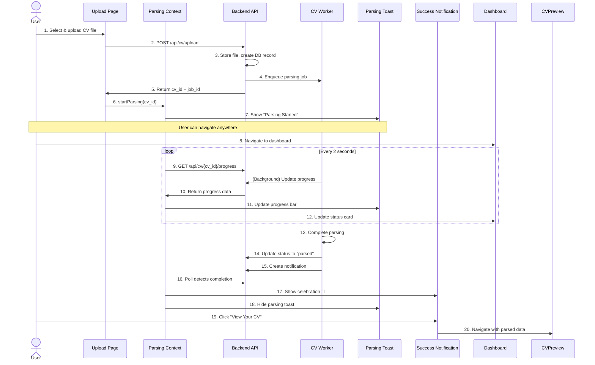
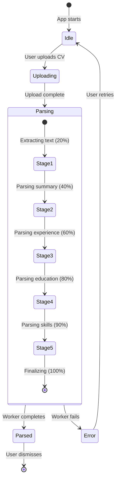
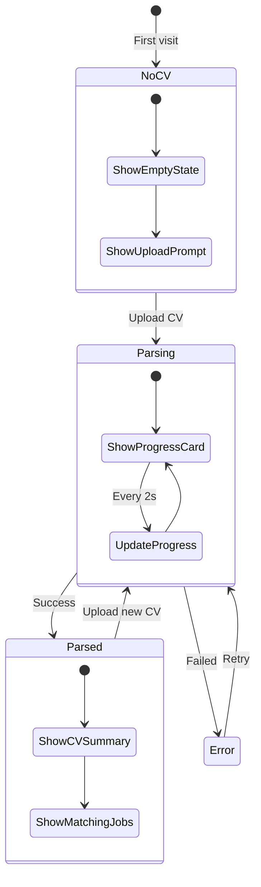
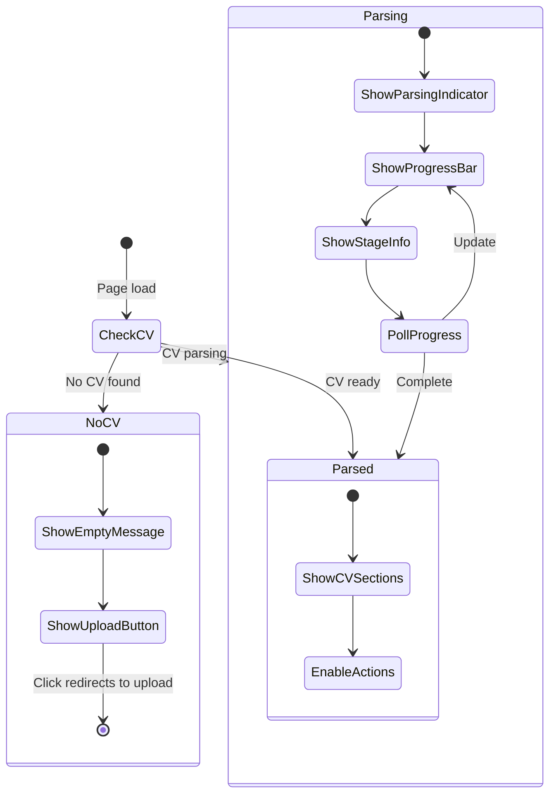
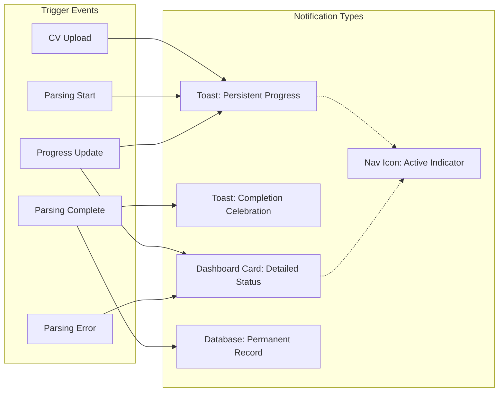
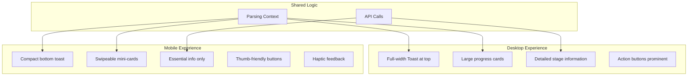
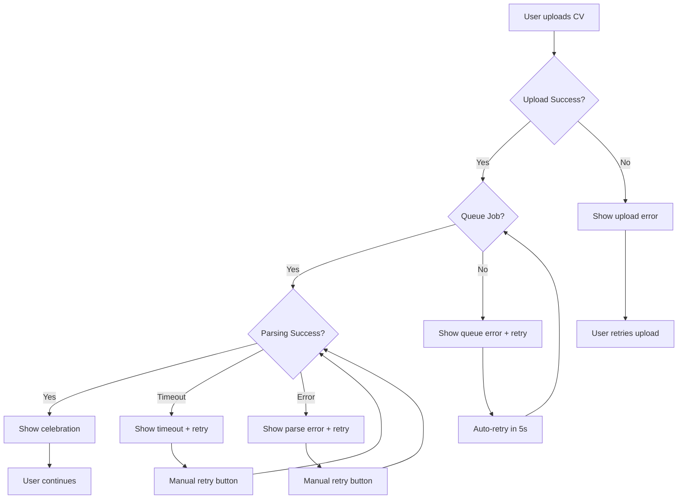
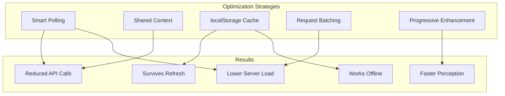

# CV Parsing UX Flow Diagrams

## System Architecture

```mermaid
graph TB
    subgraph "Frontend (React)"
        Upload[Upload CV Page]
        Context[CV Parsing Context]
        Toast[Parsing Toast Component]
        Celebration[Completion Notification]
        Dashboard[Dashboard]
        CVPreview[CV Preview Page]
        Nav[Navigation Bar]
    end
    
    subgraph "Backend (FastAPI)"
        API[CV API Endpoints]
        Queue[Redis Queue]
        Worker[CV Worker]
    end
    
    subgraph "Storage"
        Supabase[(Supabase DB)]
        Redis[(Redis Cache)]
        Storage[Supabase Storage]
    end
    
    Upload -->|1. Upload File| API
    API -->|2. Store File| Storage
    API -->|3. Create CV Record| Supabase
    API -->|4. Enqueue Job| Queue
    
    Queue -->|5. Dequeue Job| Worker
    Worker -->|6. Update Progress| Redis
    Worker -->|7. Parse Content| Worker
    Worker -->|8. Save Sections| Supabase
    Worker -->|9. Create Notification| Supabase
    
    Context -->|Poll Progress| API
    API -->|Read Progress| Redis
    Context -->|Update State| Toast
    Context -->|Update State| Dashboard
    Context -->|Update State| CVPreview
    Context -->|Update State| Nav
    
    Worker -->|Completion| Context
    Context -->|Trigger| Celebration
```

## User Flow - Happy Path



## Component State Flow



## Page-Level UX States

### Dashboard States



### CVPreview States



## Notification System Flow



## Data Flow Architecture

```mermaid
graph TB
    subgraph "Frontend State"
        LS[localStorage]
        Context[Parsing Context]
        Components[UI Components]
    end
    
    subgraph "API Layer"
        Progress[/api/cv/:id/progress]
        Status[/api/cv/:id]
        Notifications[/api/cv/notifications]
    end
    
    subgraph "Backend State"
        Redis[(Redis - Progress)]
        Postgres[(Postgres - CV Data)]
        Worker[CV Worker]
    end
    
    Context <-->|Read/Write| LS
    Context -->|Poll| Progress
    Context -->|Fetch| Status
    Context -->|Fetch| Notifications
    
    Progress -->|Read| Redis
    Status -->|Read| Postgres
    Notifications -->|Read| Postgres
    
    Worker -->|Write Progress| Redis
    Worker -->|Write Status| Postgres
    Worker -->|Create| Postgres
    
    Context -->|Update| Components
```

## Mobile vs Desktop Experience



## Error Handling Flow



## Performance Optimization



## Implementation Phases Timeline

```mermaid
gantt
    title CV Parsing UX Overhaul Timeline
    dateFormat YYYY-MM-DD
    section Phase 1: Foundation
    Context Provider           :done, p1a, 2024-01-15, 2d
    Backend Progress API       :done, p1b, 2024-01-15, 2d
    Redis Progress Storage     :done, p1c, 2024-01-16, 1d
    
    section Phase 2: Visual
    Parsing Toast              :active, p2a, 2024-01-17, 2d
    Celebration Notification   :p2b, 2024-01-18, 1d
    Dashboard Status Card      :p2c, 2024-01-19, 1d
    
    section Phase 3: Pages
    CVPreview Updates          :p3a, 2024-01-20, 1d
    Dashboard Integration      :p3b, 2024-01-21, 1d
    Navigation Updates         :p3c, 2024-01-21, 1d
    
    section Phase 4: Polish
    Smart Polling              :p4a, 2024-01-22, 1d
    Progress Estimator         :p4b, 2024-01-23, 1d
    Mobile Optimization        :p4c, 2024-01-24, 1d
    
    section Phase 5: Testing
    Integration Testing        :p5a, 2024-01-25, 1d
    E2E Testing                :p5b, 2024-01-26, 1d
    Production Deploy          :milestone, p5c, 2024-01-27, 0d