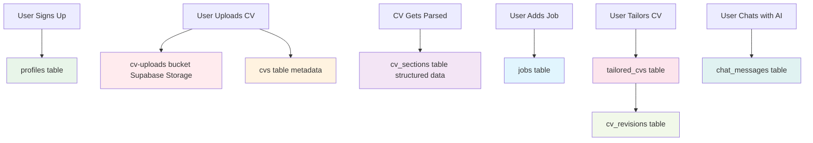
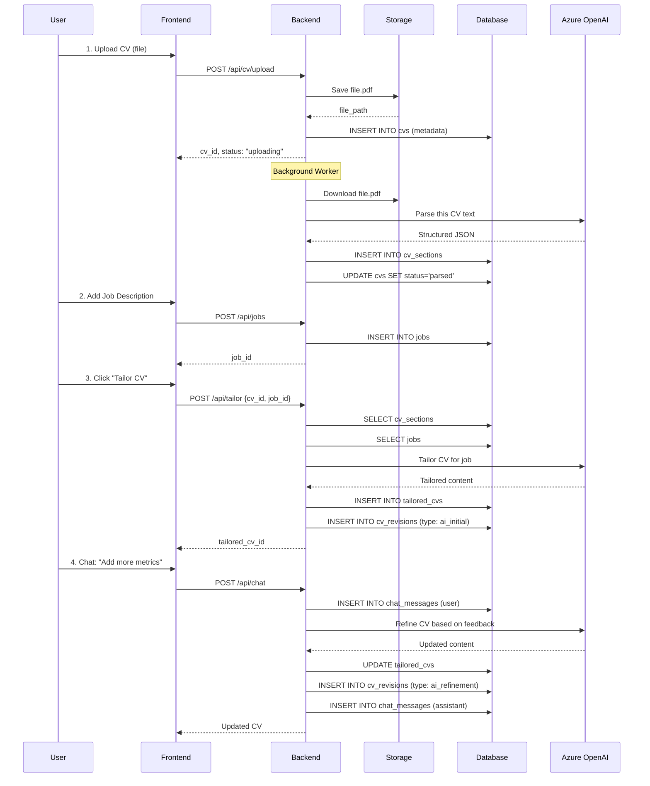

# Database Schema - What We're Saving & Why

## 📊 Data Flow Overview



---

## 🗂️ Database Tables Explained

### **1. `profiles` (Already Exists ✅)**

**Purpose**: User account information

**What's Saved**:
```javascript
{
  id: "uuid",              // User ID from Supabase Auth
  email: "user@email.com",
  full_name: "John Doe",
  avatar_url: "https://...",
  created_at: "2024-01-22T10:00:00Z",
  updated_at: "2024-01-22T10:00:00Z"
}
```

**When**: Created automatically when user signs up with Google OAuth

**Why**: Store user profile info separate from auth system

---

### **2. `cvs` (NEW - File Metadata)**

**Purpose**: Track uploaded CV files (NOT the actual file, just metadata)

**What's Saved**:
```javascript
{
  id: "uuid",
  user_id: "uuid",                           // Which user owns this CV
  original_filename: "John_Doe_CV.pdf",      // Original name
  file_path: "user-uuid/abc123.pdf",         // Path in Supabase Storage
  file_size: 245678,                          // Size in bytes
  mime_type: "application/pdf",
  status: "parsed",                           // uploaded → parsing → parsed → failed
  uploaded_at: "2024-01-22T10:00:00Z",
  parsed_at: "2024-01-22T10:02:30Z",         // When parsing completed
  error_message: null,                        // If parsing failed
  created_at: "2024-01-22T10:00:00Z",
  updated_at: "2024-01-22T10:02:30Z"
}
```

**When**: 
- Created: When user uploads CV file
- Updated: When parsing starts/completes/fails

**Why**: 
- Track which CVs belong to which user
- Know the parsing status
- Reference where actual file is stored
- Handle errors if parsing fails

**Actual CV File Stored**: In Supabase Storage bucket `cv-uploads`

---

### **3. `cv_sections` (NEW - Parsed CV Data)**

**Purpose**: Store the STRUCTURED data extracted from the CV

**What's Saved**:
```javascript
{
  id: "uuid",
  cv_id: "uuid",                    // Links to cvs table
  
  summary: "Experienced developer with 5+ years...",
  
  skills: [                          // JSONB array
    "React",
    "Python", 
    "PostgreSQL",
    "AWS"
  ],
  
  experience: [                      // JSONB array of objects
    {
      title: "Senior Developer",
      company: "TechCorp",
      period: "2021 - Present",
      description: [
        "Led team of 5 developers",
        "Built microservices architecture",
        "Reduced costs by 40%"
      ]
    },
    {
      title: "Developer",
      company: "StartupXYZ",
      period: "2019 - 2021",
      description: [...]
    }
  ],
  
  education: [                       // JSONB array of objects
    {
      degree: "BSc Computer Science",
      institution: "MIT",
      year: "2019"
    }
  ],
  
  certifications: [                  // JSONB array (optional)
    "AWS Certified Solutions Architect",
    "Google Cloud Professional"
  ],
  
  created_at: "2024-01-22T10:02:30Z",
  updated_at: "2024-01-22T10:02:30Z"
}
```

**When**: Created after AI successfully parses the CV

**Why**: 
- Store machine-readable CV data (not just raw PDF)
- Easy to query and manipulate
- Can be edited by user
- Used to generate tailored versions
- One CV = One set of sections

---

### **4. `jobs` (NEW - Job Descriptions)**

**Purpose**: Store job postings user is applying to

**What's Saved**:
```javascript
{
  id: "uuid",
  user_id: "uuid",
  title: "Senior React Developer",
  company: "Acme Corp",
  description: "We are seeking a Senior React Developer...\n\nResponsibilities:\n- Lead frontend...",
  url: "https://acmecorp.com/jobs/123",  // Optional job posting URL
  status: "active",                       // active → applied → archived
  created_at: "2024-01-22T10:05:00Z",
  updated_at: "2024-01-22T10:05:00Z"
}
```

**When**: Created when user adds a new job description

**Why**:
- Store all jobs user is applying to
- Can create multiple tailored CVs per job
- Track application status
- Reuse job description for multiple CV versions

---

### **5. `tailored_cvs` (NEW - AI-Generated Versions)**

**Purpose**: Store AI-tailored CV versions (one per job)

**What's Saved**:
```javascript
{
  id: "uuid",
  user_id: "uuid",
  cv_id: "uuid",                    // Which original CV was used
  job_id: "uuid",                   // Which job this is tailored for
  
  content: "# JOHN DOE\nSenior React Developer\n\n## SUMMARY\nExperienced...",
  
  format: "markdown",               // markdown or html
  status: "draft",                  // draft → final
  created_at: "2024-01-22T10:10:00Z",
  updated_at: "2024-01-22T10:15:00Z"
}
```

**When**: Created when AI finishes tailoring CV to job

**Why**:
- One tailored version per (CV + Job) combination
- Users can have multiple tailored versions
- Can be edited multiple times
- Content is in markdown for easy editing

**Example**: User has 1 CV + 3 Jobs = 3 tailored_cvs

---

### **6. `cv_revisions` (NEW - Version History)**

**Purpose**: Track every change made to a tailored CV

**What's Saved**:
```javascript
{
  id: "uuid",
  tailored_cv_id: "uuid",
  
  content: "# JOHN DOE\n...",       // Full CV content at this version
  
  revision_type: "ai_refinement",   // ai_initial | ai_refinement | user_edit
  description: "User asked to emphasize leadership experience",
  
  created_at: "2024-01-22T10:12:00Z"
}
```

**When**: Created every time CV is modified:
- Initial AI generation (`ai_initial`)
- User chats with AI to refine (`ai_refinement`)
- User manually edits (`user_edit`)

**Why**:
- Full version control
- User can see history of changes
- Can revert to previous version
- Track what AI changed

**Example Timeline**:
1. `ai_initial` - "Initial tailored version"
2. `ai_refinement` - "Added more metrics to achievements"
3. `user_edit` - "Changed summary wording"
4. `ai_refinement` - "Emphasized cloud experience"

---

### **7. `chat_messages` (NEW - AI Conversations)**

**Purpose**: Store chat conversations between user and AI

**What's Saved**:
```javascript
{
  id: "uuid",
  tailored_cv_id: "uuid",           // Which CV this chat is about
  
  role: "user",                      // user | assistant
  content: "Can you emphasize my leadership experience more?",
  
  created_at: "2024-01-22T10:11:30Z"
}
```

**When**: Created for each message in the chat

**Why**:
- Persist conversation history
- User can see what they asked for
- AI has context for follow-up questions
- Can review refinement process

**Example Conversation**:
```
[user] "Can you add more metrics to my achievements?"
[assistant] "I've updated your experience section to include specific metrics..."
[user] "Great! Now emphasize my cloud experience"
[assistant] "I've highlighted your AWS and Azure work..."
```

---

## 💾 Storage vs Database

### **What's in Supabase Storage** (Files)
```
cv-uploads/
├── user-uuid-1/
│   ├── abc123.pdf          ← Original CV file
│   └── def456.pdf
└── user-uuid-2/
    └── xyz789.docx
```

### **What's in PostgreSQL Database** (Structured Data)
```
tables:
- profiles           ← User info
- cvs                ← CV file metadata
- cv_sections        ← Parsed CV data
- jobs               ← Job descriptions
- tailored_cvs       ← AI-generated versions
- cv_revisions       ← Version history
- chat_messages      ← AI conversations
```

---

## 🔄 Complete Data Flow Example

### **User Journey: Upload CV → Tailor for Job**



---

## 📈 Storage Requirements Estimate

For **100 users** with average usage:

| Data Type | Per User | Total | Storage Type |
|-----------|----------|-------|--------------|
| **CV Files** | 1-2 files × 500KB | ~100MB | Supabase Storage |
| **Parsed Data** | ~10KB | ~1MB | PostgreSQL |
| **Jobs** | 5-10 jobs × 2KB | ~1.5MB | PostgreSQL |
| **Tailored CVs** | 5-10 versions × 5KB | ~3.5MB | PostgreSQL |
| **Revisions** | 20-30 × 5KB | ~12MB | PostgreSQL |
| **Chat Messages** | 50-100 × 500B | ~3.5MB | PostgreSQL |
| **Total Database** | | **~22MB** | PostgreSQL |
| **Total Storage** | | **~100MB** | Storage |

**Supabase Free Tier**: 500MB DB + 1GB Storage = ✅ **Can handle 1000+ users**

---

## 🎯 Key Decisions Explained

### **Why JSONB for skills/experience/education?**
- Flexible schema (different CVs have different structures)
- Can query within JSON (e.g., "find all users with React skill")
- Easy to update individual items
- No need for separate tables

### **Why separate `cvs` and `cv_sections`?**
- `cvs` = file metadata (path, status, timestamps)
- `cv_sections` = parsed content (data we actually use)
- Clean separation of concerns
- Can re-parse same file if needed

### **Why store full content in `cv_revisions`?**
- Complete version history
- Can restore any previous version
- Shows exactly what changed
- Small cost (5KB per revision)

### **Why store chat messages?**
- User can review what they asked
- AI has context for follow-up
- Can show refinement process
- Useful for debugging

---

## ✅ Summary

**What We Save**:
1. ✅ **User profiles** - Who they are
2. ✅ **CV files** (Storage) - Original PDFs/DOCX
3. ✅ **CV metadata** (Database) - File info, status
4. ✅ **Parsed CV data** (Database) - Structured sections
5. ✅ **Job descriptions** (Database) - What they're applying to
6. ✅ **Tailored CVs** (Database) - AI-generated versions
7. ✅ **Revision history** (Database) - All changes
8. ✅ **Chat conversations** (Database) - User ↔ AI messages

**What We DON'T Save**:
- ❌ User passwords (handled by Supabase Auth)
- ❌ Raw API responses (only final results)
- ❌ Temporary processing files
- ❌ Session data (Redis handles this)

**Result**: Everything user creates is persisted and can be retrieved/modified/deleted.

---

Does this clarify what we're saving and why? Any questions about specific tables or data structures?