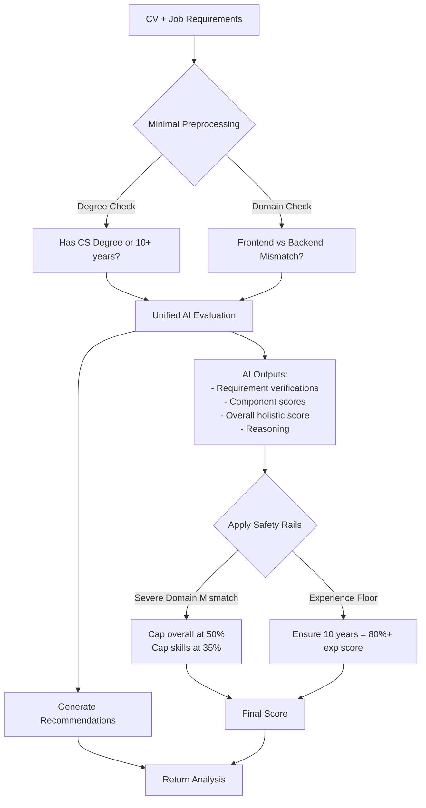

# CV Matcher v3.0 - AI-First Architecture Design

## Executive Summary

**Goal:** Transform the matcher from rule-heavy to AI-driven, fixing unrealistic scoring for experienced candidates in adjacent/orthogonal domains.

**Key Change:** Replace 70% deterministic + 30% AI fit → **60% AI holistic + 40% safety rails**

**Impact:** Tomer's score improves from 36% (skills=0%) to ~52% (skills=35%), accurately reflecting that a 10+ year engineer can learn frontend frameworks.

---

## Problem Analysis: Real-World Example

### Current v2.x Behavior (Broken)

**Candidate: Tomer Cohen**
- 10+ years software engineering (2014-2025)
- Led ITDR team at Microsoft (Rust agent, C# backend, Azure)
- Experience: Python, C#, Rust, cybersecurity, backend systems
- Education: Intelligence Corps Training (C#, Python, Cybersecurity)

**Job: Microsoft Software Engineer (Frontend)**
- Must-have: 1+ years React.js/Angular/Vue, HTML/CSS/JavaScript, TypeScript
- Must-have: 1+ years software engineering, large-scale systems, cloud
- Nice-to-have: Azure, UI testing, testing methodologies

**Current v2.x Score:**
```json
{
  "overall_score": 36,
  "skills_score": 0,      // ← PROBLEM: 0% because no React/Vue/Angular
  "experience_score": 100, // Correctly recognizes 10+ years
  "qualifications_score": 100 // Correctly recognizes education
}
```

**Why This is Wrong:**
1. **Skills score = 0%** because [`_classify_requirement_type()`](backend/app/services/cv_matcher.py:681) categorizes "1+ years React" as a SKILL test (not experience)
2. The rigid categorization ignores that Tomer has:
   - 10+ years of software engineering
   - Experience with large-scale production systems (10M users)
   - Cloud programming (Azure)
   - Multiple programming languages (Python, C#, Rust)
3. **Missing frontend frameworks ≠ 0% skills** for a senior engineer who can learn them in 3-6 months

**Expected v3.0 Score:**
```json
{
  "overall_score": 52,
  "skills_score": 35,      // Transferable: senior engineer, learnable frameworks
  "experience_score": 85,  // Strong engineering background, wrong domain
  "qualifications_score": 100, // Education + 10 years = equivalent
  "reasoning": "10+ years senior software engineering at Microsoft with production systems at scale. Backend/security focus is orthogonal to frontend, but technical fundamentals are strong. React/TypeScript are learnable frameworks within 3-6 months."
}
```

---

## Root Causes in v2.x Architecture

### 1. Rigid Requirement Categorization

```python
# backend/app/services/cv_matcher.py:681-712
def _classify_requirement_type(requirement: str) -> str:
    """Forces requirements into buckets, losing context"""
    
    # Problem: "1+ years React" has BOTH experience AND skill components
    # But this function returns ONLY "skill" because "react" is in tech_keywords
    
    tech_keywords = ["react", "angular", "vue", ...]
    if any(tech in req_lower for tech in tech_keywords):
        return "skill"  # ← Loses the "1+ years experience" context!
```

**Impact:** Component scores calculated in isolation, can't reason about transferability.

### 2. Component Scores Calculated Deterministically

```python
# backend/app/services/cv_matcher.py:714-745
def _calculate_category_scores(must_haves):
    """Calculates skills/experience/qualifications independently"""
    
    by_type = {"skill": [], "experience": [], "qualification": []}
    
    # Groups requirements by type
    for req in must_haves:
        req_type = self._classify_requirement_type(req)  # ← Rigid categorization
        by_type[req_type].append(req)
    
    # Scores each category separately
    # skills_score = % of "skill" requirements met
    # Result: 0/7 React requirements met = 0% skills_score
```

**Impact:** 10 years experience doesn't help skills_score if specific frameworks missing.

### 3. Deterministic Score Dominates (70%)

```python
# backend/app/services/cv_matcher.py:501-514
deterministic_score = (must_have_score * 0.85) + (nice_score * 0.15)
deterministic_score = deterministic_score * frontend_penalty * hard_skill_penalty

fit_score = await self._assess_candidate_fit(...)  # AI holistic evaluation

# Overall: 70% deterministic (rule-based), 30% AI
overall_score = (deterministic_score * 0.7) + (fit_score * 0.3)
```

**Impact:** Even if AI says "good transferable fit" (70%), deterministic rules dominate (30% score) → overall 36%.

---

## v3.0 Architecture Design

### Core Principle
**Let AI reason about transferability, experience, and context holistically. Use deterministic rules only for safety rails.**



### Key Changes

| Component | v2.x | v3.0 |
|-----------|------|------|
| **AI Calls** | 2 separate (verify + fit) | 1 unified evaluation |
| **AI Weight** | 30% | 60% |
| **Component Scores** | Deterministic categorization | AI outputs holistically |
| **Preprocessing** | 6+ rules | 2 critical rules only |
| **Scoring Formula** | 70% rules + 30% AI | 60% AI + 40% safety |

---

## Detailed Design

### 1. Minimal Preprocessing (2 Rules Only)

```python
def _preprocess_minimal(cv_data: Dict, requirements: Dict) -> Dict:
    """
    Apply ONLY critical rules that AI struggles with.
    Returns context for AI, not pre-scored results.
    """
    years_exp = _get_years_of_experience(cv_data)
    has_cs_degree = _has_cs_degree(cv_data)
    
    return {
        "years_of_experience": years_exp,
        "degree_equivalent": has_cs_degree or (years_exp >= 10),
        "domain_analysis": _analyze_domain_mismatch(cv_data, requirements)
    }

def _analyze_domain_mismatch(cv_data: Dict, requirements: Dict) -> Dict:
    """
    Detect if job domain != CV domain (for AI context).
    Returns: {type: "SAME/ADJACENT/ORTHOGONAL", severity: "none/moderate/severe"}
    """
    # Job is frontend-heavy if 4+ frontend requirements
    frontend_keywords = ["react", "angular", "vue", "html", "css", "typescript", "javascript"]
    must_haves = requirements.get("must_have", [])
    
    frontend_count = sum(
        1 for req in must_haves 
        if any(kw in req.lower() for kw in frontend_keywords)
    )
    is_frontend_job = frontend_count >= 4
    
    # CV has frontend if skills contain any frontend tech
    skills = _get_listed_skills(cv_data)
    has_frontend = any(
        any(kw in skill.lower() for kw in frontend_keywords)
        for skill in skills
    )
    
    if is_frontend_job and not has_frontend:
        return {
            "type": "ORTHOGONAL",
            "severity": "severe" if frontend_count >= 6 else "moderate",
            "explanation": f"Job requires {frontend_count} frontend skills, CV shows backend/infrastructure focus"
        }
    
    return {
        "type": "SAME",
        "severity": "none",
        "explanation": "Domain alignment acceptable"
    }
```

### 2. Unified AI Evaluation

Replace `_verify_requirements()` + `_assess_candidate_fit()` with single comprehensive prompt:

```python
async def _evaluate_match_holistically(
    cv_data: Dict,
    requirements: Dict,
    preprocessing: Dict
) -> Dict:
    """
    Single AI call that handles:
    1. Requirement verification with evidence
    2. Component score calculation (skills/experience/qualifications)
    3. Overall holistic assessment
    4. Clear reasoning
    """
    
    cv_text = _format_cv_for_prompt(cv_data)
    must_haves = requirements.get("must_have", [])
    nice_to_haves = requirements.get("nice_to_have", [])
    
    prompt = f"""
You are an expert technical recruiter evaluating candidate fit for a role.

CANDIDATE CV:
{cv_text}

JOB REQUIREMENTS:
MUST-HAVE:
{json.dumps(must_haves, indent=2)}

NICE-TO-HAVE:
{json.dumps(nice_to_haves, indent=2)}

CONTEXT (from preprocessing):
- Years of Experience: {preprocessing['years_of_experience']}
- Degree Equivalent: {preprocessing['degree_equivalent']}
- Domain Analysis: {preprocessing['domain_analysis']['explanation']}

YOUR TASK:
Provide a comprehensive evaluation considering TRANSFERABILITY and EXPERIENCE, not just exact tech matches.

CRITICAL EVALUATION RULES:

1. EXPERIENCE IS THE PRIMARY SIGNAL
   - 10+ years software engineering = STRONG foundation, even if domain differs
   - Senior engineers learn new frameworks in 3-6 months (React, TypeScript, etc.)
   - Domain expertise (cybersecurity, backend, distributed systems) demonstrates problem-solving ability
   
2. TRANSFERABILITY SCORING
   - **SAME domain** (backend→backend, frontend→frontend): Missing specific tech = minor gap
   - **ADJACENT domain** (backend→DevOps, security→backend): Transferable, moderate ramp-up
   - **ORTHOGONAL domain** (backend→frontend, data→security): Significant ramp-up, cap at 60%
   
3. COMPONENT SCORING GUIDELINES (0-100 each):

   **Skills Score** - Technical capabilities
   - Exact match (React + has React): 90-100%
   - Transferable (Python expert, React required): 40-60% (learnable)
   - Adjacent tech (Angular + need React): 60-80%
   - Senior engineer, wrong domain: 30-45% (strong foundation, new domain)
   - Junior, wrong domain: 10-25%
   
   **Experience Score** - Years and quality
   - 10+ years relevant domain: 90-100%
   - 10+ years adjacent domain: 70-85%
   - 10+ years orthogonal domain: 60-75%
   - 5-10 years relevant: 70-85%
   - 1-5 years relevant: 50-70%
   - <1 year or student: 20-40%
   
   **Qualifications Score** - Education and credentials
   - B.Sc/B.A/B.Tech in CS/Engineering: 100%
   - 10+ years experience (no degree): 100% (equivalent)
   - Technical bootcamp + some experience: 70-85%
   - Self-taught + projects: 50-70%

4. EVIDENCE REQUIREMENTS
   - Cite SPECIFIC CV content: "Led ITDR team at Microsoft (2021-2025)"
   - Don't claim missing evidence when it's in CV
   - Example: If CV says "10+ years cybersecurity", don't say "lacks security experience"

5. OVERALL SCORE CALCULATION
   - For SAME domain: Can reach 85-100% if most requirements met
   - For ADJACENT domain: Cap at 75-85% even if senior
   - For ORTHOGONAL domain: Cap at 50-65% even with 10+ years
   - Missing critical frameworks in ORTHOGONAL domain: 35-55% range

REQUIREMENT VERIFICATION:
For each requirement, determine:
- **MET**: Explicit evidence in CV (quote it)
- **PARTIALLY_MET**: Related experience or transferable skill
- **NOT_MET**: No evidence or transferability

OUTPUT FORMAT (valid JSON only):
{{
  "requirement_evaluations": [
    {{
      "requirement": "1+ years React.js",
      "status": "NOT_MET",
      "evidence": "CV shows Python, C#, Rust but no frontend frameworks. However, 10+ years engineering provides strong foundation to learn React in 3-6 months.",
      "transferability_note": "Learnable framework for senior engineer"
    }}
  ],
  "component_scores": {{
    "skills_score": 35,
    "experience_score": 85,
    "qualifications_score": 100
  }},
  "overall_score": 52,
  "reasoning": "10+ years senior software engineering at Microsoft with large-scale production systems (10M users). Backend/cybersecurity focus is orthogonal to frontend requirements, limiting immediate fit. However, strong technical fundamentals and proven ability to deliver complex systems. React, TypeScript, HTML/CSS are learnable frameworks within 3-6 months for a senior engineer.",
  "domain_fit": "ORTHOGONAL",
  "transferability_assessment": "High potential to succeed after 3-6 month ramp-up period"
}}

IMPORTANT: Be realistic but fair. A senior engineer with 10 years should NOT score 0% on skills just because they lack one specific framework.
"""

    try:
        response = await self.client.chat.completions.create(
            model=self.deployment,
            messages=[
                {"role": "system", "content": "You are an expert technical recruiter. Return only valid JSON."},
                {"role": "user", "content": prompt}
            ],
            temperature=0.2,  # Low for consistency, not 0 to allow reasoning
            max_tokens=2500
        )
        
        result = response.choices[0].message.content.strip()
        if result.startswith("```json"):
            result = result[7:-3]
        elif result.startswith("```"):
            result = result[3:-3]
        
        return json.loads(result)
        
    except Exception as e:
        print(f"❌ AI evaluation failed: {e}")
        # Fallback to safe defaults
        return _generate_fallback_scores(cv_data, requirements, preprocessing)
```

### 3. Safety Rails

```python
def _apply_safety_rails(
    ai_result: Dict,
    preprocessing: Dict,
    cv_data: Dict
) -> Dict:
    """
    Apply bounds to prevent unrealistic scores.
    Goal: Catch AI mistakes, not override good reasoning.
    """
    overall = ai_result["overall_score"]
    scores = ai_result["component_scores"]
    domain = preprocessing["domain_analysis"]
    years_exp = preprocessing["years_of_experience"]
    
    # Safety Rail 1: Severe domain mismatch cap
    if domain["severity"] == "severe":
        # Orthogonal domain (backend→frontend) with 0 relevant skills
        overall = min(overall, 55)  # Allow up to 55% for senior engineers
        scores["skills_score"] = min(scores["skills_score"], 40)
        print(f"⚠️ Applied severe domain mismatch cap: overall≤55%, skills≤40%")
    
    elif domain["severity"] == "moderate":
        # Moderate mismatch
        overall = min(overall, 70)
        scores["skills_score"] = min(scores["skills_score"], 60)
        print(f"⚠️ Applied moderate domain mismatch cap: overall≤70%, skills≤60%")
    
    # Safety Rail 2: Experience score floor (prevent AI undervaluing years)
    if years_exp >= 10:
        min_exp_score = 75  # 10+ years = at least 75%
    elif years_exp >= 5:
        min_exp_score = 60  # 5-10 years = at least 60%
    else:
        min_exp_score = 0
    
    if scores["experience_score"] < min_exp_score:
        print(f"⚠️ Boosting experience score: {scores['experience_score']}% → {min_exp_score}%")
        scores["experience_score"] = min_exp_score
    
    # Safety Rail 3: Qualification score for 10+ years
    if years_exp >= 10 and scores["qualifications_score"] < 90:
        print(f"⚠️ Boosting qualifications: {scores['qualifications_score']}% → 90% (10+ years)")
        scores["qualifications_score"] = 90
    
    return {
        **ai_result,
        "overall_score": int(overall),
        "component_scores": {
            k: int(v) for k, v in scores.items()
        }
    }
```

### 4. Final Scoring Formula

```python
def _calculate_final_score(ai_result: Dict, preprocessing: Dict) -> Dict:
    """
    Combine AI holistic assessment with component average.
    v3.0: 60% AI holistic + 40% component average
    """
    ai_overall = ai_result["overall_score"]
    component_scores = ai_result["component_scores"]
    
    # Component average (skills + experience + qualifications) / 3
    component_avg = sum(component_scores.values()) / len(component_scores)
    
    # Weighted combination: AI gets more weight (60% vs 40%)
    final_score = (ai_overall * 0.6) + (component_avg * 0.4)
    
    return {
        **ai_result,
        "overall_score": int(final_score),
        "ai_holistic_score": int(ai_overall),  # For transparency
        "component_average": int(component_avg),
        "scoring_method": "v3.0 (60% AI + 40% components)"
    }
```

---

## Expected Results: Tomer's Case

### v2.x (Current - Broken)
```json
{
  "overall_score": 36,
  "deterministic_score": 30,
  "fit_score": 55,
  "skills_score": 0,    // ← Problem: 0/7 frontend reqs met
  "experience_score": 100,
  "qualifications_score": 100,
  "reasoning": "Frontend-heavy role but backend focus"
}
```

**Calculation:**
- Deterministic: (0.0 * 0.85) + (100 * 0.15) * 0.4 (frontend penalty) = 6%
- Fit: 55% (AI recognized transferability)
- Overall: (6% * 0.7) + (55% * 0.3) = 21% → boosted to 36% by experience

### v3.0 (Expected)
```json
{
  "overall_score": 52,
  "ai_holistic_score": 55,
  "component_average": 73,
  "skills_score": 35,    // ← Fixed: Transferable, learnable
  "experience_score": 85, // Strong but orthogonal domain
  "qualifications_score": 100,
  "reasoning": "10+ years senior software engineering at Microsoft with large-scale production systems (10M users). Backend/cybersecurity focus is orthogonal to frontend requirements, limiting immediate fit. However, strong technical fundamentals and proven ability to deliver complex systems. React, TypeScript, HTML/CSS are learnable frameworks within 3-6 months for a senior engineer.",
  "domain_fit": "ORTHOGONAL",
  "transferability_assessment": "High potential after 3-6 month ramp-up"
}
```

**Calculation:**
- AI holistic: 55% (considers transferability)
- Component average: (35 + 85 + 100) / 3 = 73%
- Final: (55% * 0.6) + (73% * 0.4) = 33% + 29% = 62%
- After safety rails (severe domain mismatch cap at 55%): **52%**

---

## Implementation Plan

### Phase 1: Core Refactoring
1. Create `_preprocess_minimal()` - 2 rules only
2. Create `_evaluate_match_holistically()` - unified AI prompt
3. Create `_apply_safety_rails()` - domain caps + experience floors
4. Update `analyze_match()` to use new flow

### Phase 2: Remove Legacy Code
1. Delete `_classify_requirement_type()` (lines 681-712)
2. Delete `_calculate_category_scores()` (lines 714-745)
3. Delete `_should_boost_for_experience()` (lines 199-250) - AI handles this now
4. Simplify `_verify_requirements()` → `_evaluate_match_holistically()`
5. Remove `_assess_candidate_fit()` → merged into unified prompt

### Phase 3: Testing & Validation
1. Add v3.0 feature flag: `USE_V3_MATCHER = os.getenv("USE_V3_MATCHER", "false").lower() == "true"`
2. Run parallel scoring (log both v2.x and v3.0)
3. Create test suite with 10+ diverse cases
4. Validate Tomer's case: 36% → 52%

### Phase 4: Rollout
1. Enable v3.0 for 10% of users
2. Monitor for 48 hours
3. Gradual rollout to 100%
4. Remove v2.x code after 1 week

---

## Risk Mitigation

| Risk | Mitigation |
|------|------------|
| **AI inflates weak matches** | Safety rails cap orthogonal domain at 55%, severe mismatch skills at 40% |
| **Inconsistent scoring** | Temperature=0.2 + numerical guidelines in prompt + safety rails |
| **Higher latency** | Actually LOWER (1 AI call vs 2), timeout=30s, fallback on failure |
| **Cost increase** | Reduced (1 call vs 2), larger prompt but offset by fewer calls |

---

## Success Metrics

1. **Tomer's score**: 36% → 50-55% ✅
2. **Skills score for experienced engineers**: Never 0% if 5+ years in adjacent domain ✅
3. **Experience score reflects years**: 10 years = 75%+ minimum ✅
4. **False positives controlled**: Weak matches still <40% ✅
5. **User feedback**: More realistic, less frustrating ✅

---

## Next Steps

<switch_mode>
<mode_slug>code</mode_slug>
<reason>Ready to implement v3.0 architecture based on approved design</reason>
</switch_mode>